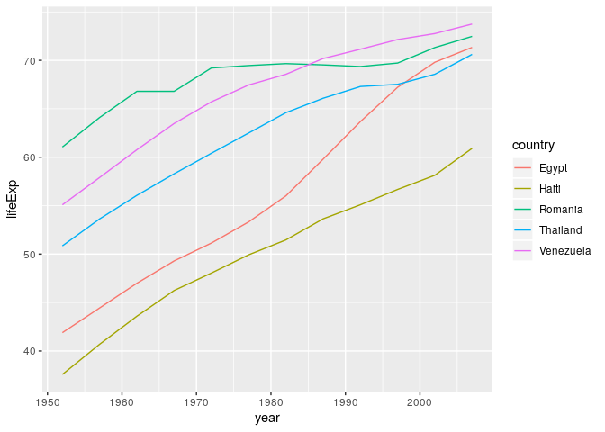
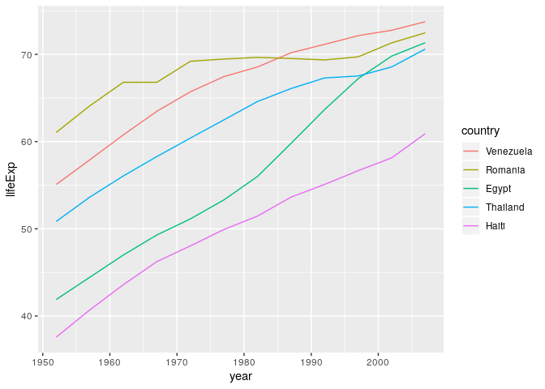

Chapter 10 STAT545
================
Federico Andrade-Rivas
March 4, 2020

FACTORS
-------

### 10.4 Factor Inspection

``` r
str(gapminder$continent)
```

    ##  Factor w/ 5 levels "Africa","Americas",..: 3 3 3 3 3 3 3 3 3 3 ...

``` r
levels(gapminder$continent)
```

    ## [1] "Africa"   "Americas" "Asia"     "Europe"   "Oceania"

``` r
nlevels(gapminder$continent)
```

    ## [1] 5

``` r
class(gapminder$continent)
```

    ## [1] "factor"

``` r
fct_count(gapminder$continent)
```

    ## # A tibble: 5 x 2
    ##   f            n
    ##   <fct>    <int>
    ## 1 Africa     624
    ## 2 Americas   300
    ## 3 Asia       396
    ## 4 Europe     360
    ## 5 Oceania     24

``` r
gapminder %>% count(continent)
```

    ## # A tibble: 5 x 2
    ##   continent     n
    ##   <fct>     <int>
    ## 1 Africa      624
    ## 2 Americas    300
    ## 3 Asia        396
    ## 4 Europe      360
    ## 5 Oceania      24

### 10.5 Dropping unused levels

``` r
nlevels(gapminder$country)
```

    ## [1] 142

``` r
#Watch what happens to the levels of country (= nothing) when we filter Gapminder to a handful of countries.

h_countries <- c("Colombia", "Canada", "South Africa", "Ecuador", "Costa Rica", "Peru")
h_gap <- gapminder %>% filter(country %in% h_countries)
nlevels(h_gap$country)
```

    ## [1] 142

``` r
#Even though h_gap only has data for a handful of countries, we are still schlepping around all 142 levels from the original gapminder tibble.
```

Dropping levels using different strategies

``` r
h_gapdropped <- h_gap %>% droplevels()
nlevels(h_gapdropped$country)
```

    ## [1] 6

``` r
h_gap$country %>% fct_drop() %>% 
                  levels()
```

    ## [1] "Canada"       "Colombia"     "Costa Rica"   "Ecuador"      "Peru"        
    ## [6] "South Africa"

### Exercise 10.5. Filter the gapminder data down to rows where population is less than a quarter of a million, i.e. 250,000. Get rid of the unused factor levels for country and continent in different ways, such as:

``` r
nlevels(gapminder$country)
```

    ## [1] 142

``` r
nlevels(gapminder$continent)
```

    ## [1] 5

``` r
#using droplevels()
gap_Lessdrop <- gapminder %>% filter(pop < 250000) %>% 
                              droplevels()  
nlevels(gap_Lessdrop$country)
```

    ## [1] 7

``` r
nlevels(gap_Lessdrop$continent)            
```

    ## [1] 3

``` r
# using fct_drop() inside mutate() NOT WORKING

#gap_lessfct <- gapminder %>% mutate(countryless1qrt = pop < 250000, fct_drop(country)) %>% 
 #filter(countryless1qrt == TRUE) #%>% 
   #nlevels(gap_lessfct$country)
```

### Change order of the levels, principled

Order by frequency forward and backwards

``` r
gapminder$continent %>% levels() 
```

    ## [1] "Africa"   "Americas" "Asia"     "Europe"   "Oceania"

``` r
gapminder$continent %>% fct_infreq() %>% levels()
```

    ## [1] "Africa"   "Asia"     "Europe"   "Americas" "Oceania"

``` r
gapminder$continent %>% fct_infreq() %>% fct_rev() %>% levels()
```

    ## [1] "Oceania"  "Americas" "Europe"   "Asia"     "Africa"

Order country by other factor (The factor is the grouping variable and the default summarizing function is median() but you can specify something else.). Usse .desc for backwards

``` r
fct_reorder(gapminder$country, gapminder$lifeExp) %>% levels() %>% head() 
```

    ## [1] "Sierra Leone"  "Guinea-Bissau" "Afghanistan"   "Angola"       
    ## [5] "Somalia"       "Guinea"

``` r
fct_reorder(gapminder$country, gapminder$lifeExp, min) %>% levels() %>% head()
```

    ## [1] "Rwanda"       "Afghanistan"  "Gambia"       "Angola"       "Sierra Leone"
    ## [6] "Cambodia"

``` r
fct_reorder(gapminder$country, gapminder$lifeExp, median, .desc = TRUE) %>% levels() %>% head()
```

    ## [1] "Iceland"     "Japan"       "Sweden"      "Switzerland" "Netherlands"
    ## [6] "Norway"


Use fct\_reorder2() when you have a line chart of a quantitative x against another quantitative y and your factor provides the color. This way the legend appears in some order as the data! Contrast the legend on the left with the one on the right.



Change order of the levels, “because I said so”

``` r
h_gap$country %>% levels()
```

    ## [1] "Egypt"     "Haiti"     "Romania"   "Thailand"  "Venezuela"

``` r
h_gap$country %>% fct_relevel("Thailand", "Venezuela", "Romania") %>% levels()
```

    ## [1] "Thailand"  "Venezuela" "Romania"   "Egypt"     "Haiti"

Changing names of levels

``` r
i_gap <- gapminder %>% filter(country %in% c("Colombia", "Ecuador", "Chile", "Mexico", "Argentina")) %>% droplevels()

i_gap$country %>% fct_recode("Chimbchombianos" = "Colombia", "Merito" = "Mexico") %>% levels()
```

    ## [1] "Argentina"       "Chile"           "Chimbchombianos" "Ecuador"        
    ## [5] "Merito"

Exercise: Isolate the data for "Australia", "Korea, Dem. Rep.", and "Korea, Rep." in the 2000x. Revalue the country factor levels to "Oz", "North Korea", and "South Korea".

``` r
Revalue_gap <- gapminder %>% filter(country %in% c("Australia", "Korea, Dem. Rep.", "Korea, Rep."), year >= 2000) %>% droplevels()

Revalue_gap$country %>% fct_recode("Oz" = "Australia", "North Korea" = "Korea, Dem. Rep.", "South Korea" = "Korea, Rep.") %>% levels()
```

    ## [1] "Oz"          "North Korea" "South Korea"

``` r
Revalue_gap
```

    ## # A tibble: 6 x 6
    ##   country          continent  year lifeExp      pop gdpPercap
    ##   <fct>            <fct>     <int>   <dbl>    <int>     <dbl>
    ## 1 Australia        Oceania    2002    80.4 19546792    30688.
    ## 2 Australia        Oceania    2007    81.2 20434176    34435.
    ## 3 Korea, Dem. Rep. Asia       2002    66.7 22215365     1647.
    ## 4 Korea, Dem. Rep. Asia       2007    67.3 23301725     1593.
    ## 5 Korea, Rep.      Asia       2002    77.0 47969150    19234.
    ## 6 Korea, Rep.      Asia       2007    78.6 49044790    23348.

Let’s create two data frames, each with data from two countries, dropping unused factor levels.

``` r
df1 <- gapminder %>% filter(country %in% c("Colombia", "South Africa"), year >= 2000) %>%
                    droplevels()

df2 <- gapminder %>% filter(country %in% c("Canada", "Peru"), year  >= 2000) %>% 
                      droplevels()

nlevels(df1$country)
```

    ## [1] 2

``` r
nlevels(df2$country)
```

    ## [1] 2

Combining the levels using fct\_c(). And exploring different forms of row binding

``` r
fct_c(df1$country, df2$country)
```

    ## [1] Colombia     Colombia     South Africa South Africa Canada      
    ## [6] Canada       Peru         Peru        
    ## Levels: Colombia South Africa Canada Peru

``` r
bind_rows(df1, df2)
```

    ## Warning in bind_rows_(x, .id): Unequal factor levels: coercing to character

    ## Warning in bind_rows_(x, .id): binding character and factor vector, coercing
    ## into character vector

    ## Warning in bind_rows_(x, .id): binding character and factor vector, coercing
    ## into character vector

    ## Warning in bind_rows_(x, .id): Unequal factor levels: coercing to character

    ## Warning in bind_rows_(x, .id): binding character and factor vector, coercing
    ## into character vector

    ## Warning in bind_rows_(x, .id): binding character and factor vector, coercing
    ## into character vector

    ## # A tibble: 8 x 6
    ##   country      continent  year lifeExp      pop gdpPercap
    ##   <chr>        <chr>     <int>   <dbl>    <int>     <dbl>
    ## 1 Colombia     Americas   2002    71.7 41008227     5755.
    ## 2 Colombia     Americas   2007    72.9 44227550     7007.
    ## 3 South Africa Africa     2002    53.4 44433622     7711.
    ## 4 South Africa Africa     2007    49.3 43997828     9270.
    ## 5 Canada       Americas   2002    79.8 31902268    33329.
    ## 6 Canada       Americas   2007    80.7 33390141    36319.
    ## 7 Peru         Americas   2002    69.9 26769436     5909.
    ## 8 Peru         Americas   2007    71.4 28674757     7409.

``` r
rbind(df1, df2)
```

    ## # A tibble: 8 x 6
    ##   country      continent  year lifeExp      pop gdpPercap
    ##   <fct>        <fct>     <int>   <dbl>    <int>     <dbl>
    ## 1 Colombia     Americas   2002    71.7 41008227     5755.
    ## 2 Colombia     Americas   2007    72.9 44227550     7007.
    ## 3 South Africa Africa     2002    53.4 44433622     7711.
    ## 4 South Africa Africa     2007    49.3 43997828     9270.
    ## 5 Canada       Americas   2002    79.8 31902268    33329.
    ## 6 Canada       Americas   2007    80.7 33390141    36319.
    ## 7 Peru         Americas   2002    69.9 26769436     5909.
    ## 8 Peru         Americas   2007    71.4 28674757     7409.
