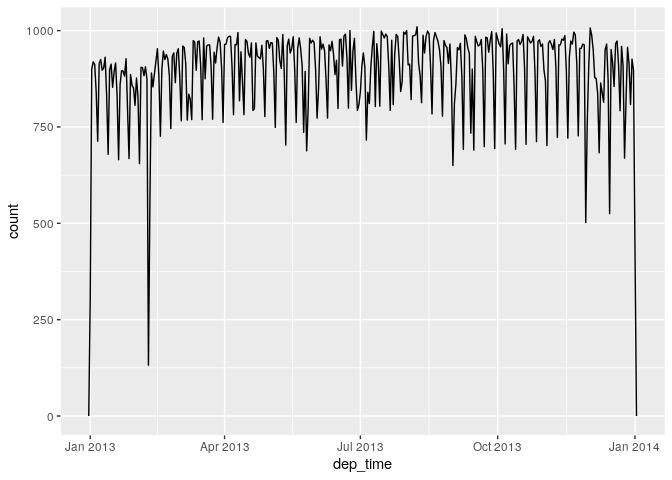
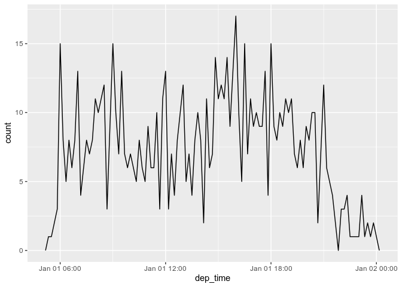

Chapter 13
================
Federico Andrade-Rivas
March 19, 2020

Chapter 13 Dates and Times
--------------------------

``` r
library(tidyverse)
```

    ## ── Attaching packages ────────────────────────────────────────────────────────────────── tidyverse 1.3.0 ──

    ## ✔ ggplot2 3.2.1     ✔ purrr   0.3.3
    ## ✔ tibble  2.1.3     ✔ dplyr   0.8.3
    ## ✔ tidyr   1.0.0     ✔ stringr 1.4.0
    ## ✔ readr   1.3.1     ✔ forcats 0.4.0

    ## ── Conflicts ───────────────────────────────────────────────────────────────────── tidyverse_conflicts() ──
    ## ✖ dplyr::filter() masks stats::filter()
    ## ✖ dplyr::lag()    masks stats::lag()

``` r
library(lubridate)
```

    ## 
    ## Attaching package: 'lubridate'

    ## The following object is masked from 'package:base':
    ## 
    ##     date

``` r
library(nycflights13)
```

Get times! Lubridate, and Rbase

``` r
today()
```

    ## [1] "2020-03-19"

``` r
#lubridate

Sys.Date()
```

    ## [1] "2020-03-19"

``` r
#Base R

str(Sys.Date())
```

    ##  Date[1:1], format: "2020-03-19"

``` r
class(Sys.Date())
```

    ## [1] "Date"

``` r
Sys.time()
```

    ## [1] "2020-03-19 21:01:28 PDT"

``` r
#Rbase

now()
```

    ## [1] "2020-03-19 21:01:28 PDT"

``` r
#Lubridate

##They both give you something of class POSIXct in R jargon.
str(Sys.time())
```

    ##  POSIXct[1:1], format: "2020-03-19 21:01:28"

``` r
class(Sys.time())
```

    ## [1] "POSIXct" "POSIXt"

``` r
str(now())
```

    ##  POSIXct[1:1], format: "2020-03-19 21:01:28"

``` r
class(now())
```

    ## [1] "POSIXct" "POSIXt"

### 13.5 Get date or date-time from character

An approach is to use the helpers provided by lubridate. They automatically work out the format once you specify the order of the component. To use them, identify the order in which year, month, and day appear in your dates, then arrange “y”, “m”, and “d” in the same order. That gives you the name of the lubridate function that will parse your date. For example:

These functions also take unquoted numbers. This is the most concise way to create a single date/time object, as you might need when filtering date/time data. ymd() is short and unambiguous.

``` r
ymd("2017-01-31")
```

    ## [1] "2017-01-31"

``` r
mdy("January 31st, 2017")
```

    ## [1] "2017-01-31"

``` r
dmy("2017-01-31")
```

    ## Warning: All formats failed to parse. No formats found.

    ## [1] NA

``` r
ymd(20170131)
```

    ## [1] "2017-01-31"

To create a date-time, add an underscore and one or more of “h”, “m”, and “s” to the name of the parsing function:

``` r
ymd_hms("2017-01-31 21:34:58")
```

    ## [1] "2017-01-31 21:34:58 UTC"

``` r
mdy_hm("01/31/2017 08:01")
```

    ## [1] "2017-01-31 08:01:00 UTC"

``` r
##You can also force the creation of a date-time from a date by supplying a timezone:
ymd(20170131, tz = "UTC")
```

    ## [1] "2017-01-31 UTC"

### 13.6 Build date or date-time from parts

Instead of a single string, sometimes you’ll have the individual components of the date-time spread across multiple columns. This is what we have in the flights data:

``` r
flights %>% select(year, month, day, hour, minute)
```

    ## # A tibble: 336,776 x 5
    ##     year month   day  hour minute
    ##    <int> <int> <int> <dbl>  <dbl>
    ##  1  2013     1     1     5     15
    ##  2  2013     1     1     5     29
    ##  3  2013     1     1     5     40
    ##  4  2013     1     1     5     45
    ##  5  2013     1     1     6      0
    ##  6  2013     1     1     5     58
    ##  7  2013     1     1     6      0
    ##  8  2013     1     1     6      0
    ##  9  2013     1     1     6      0
    ## 10  2013     1     1     6      0
    ## # … with 336,766 more rows

To create a date/time from this sort of input, use make\_date() for dates, or make\_datetime() for date-times:

``` r
flights %>% select(year, month, day, hour, minute) %>% 
            mutate(departure = make_datetime(year, month, day, hour, minute))
```

    ## # A tibble: 336,776 x 6
    ##     year month   day  hour minute departure          
    ##    <int> <int> <int> <dbl>  <dbl> <dttm>             
    ##  1  2013     1     1     5     15 2013-01-01 05:15:00
    ##  2  2013     1     1     5     29 2013-01-01 05:29:00
    ##  3  2013     1     1     5     40 2013-01-01 05:40:00
    ##  4  2013     1     1     5     45 2013-01-01 05:45:00
    ##  5  2013     1     1     6      0 2013-01-01 06:00:00
    ##  6  2013     1     1     5     58 2013-01-01 05:58:00
    ##  7  2013     1     1     6      0 2013-01-01 06:00:00
    ##  8  2013     1     1     6      0 2013-01-01 06:00:00
    ##  9  2013     1     1     6      0 2013-01-01 06:00:00
    ## 10  2013     1     1     6      0 2013-01-01 06:00:00
    ## # … with 336,766 more rows

Let’s do the same thing for each of the four time columns in flights. The times are represented in a slightly odd format, so we use modulus arithmetic to pull out the hour and minute components. Once I’ve created the date-time variables, I focus in on the variables we’ll explore in the rest of the chapter.

``` r
make_datetime_100 <- function(year, month, day, time) {
make_datetime(year, month, day, time %/% 100, time %% 100)}

flights_dt <- flights %>% 
  filter(!is.na(dep_time), !is.na(arr_time)) %>% 
  mutate(
    dep_time = make_datetime_100(year, month, day, dep_time),
    arr_time = make_datetime_100(year, month, day, arr_time),
    sched_dep_time = make_datetime_100(year, month, day, sched_dep_time),
    sched_arr_time = make_datetime_100(year, month, day, sched_arr_time)
  ) %>% 
  select(origin, dest, ends_with("delay"), ends_with("time"))
##NOTE the ends_with() function. Selects the variable has the string provided at the end =)

flights_dt
```

    ## # A tibble: 328,063 x 9
    ##    origin dest  dep_delay arr_delay dep_time            sched_dep_time     
    ##    <chr>  <chr>     <dbl>     <dbl> <dttm>              <dttm>             
    ##  1 EWR    IAH           2        11 2013-01-01 05:17:00 2013-01-01 05:15:00
    ##  2 LGA    IAH           4        20 2013-01-01 05:33:00 2013-01-01 05:29:00
    ##  3 JFK    MIA           2        33 2013-01-01 05:42:00 2013-01-01 05:40:00
    ##  4 JFK    BQN          -1       -18 2013-01-01 05:44:00 2013-01-01 05:45:00
    ##  5 LGA    ATL          -6       -25 2013-01-01 05:54:00 2013-01-01 06:00:00
    ##  6 EWR    ORD          -4        12 2013-01-01 05:54:00 2013-01-01 05:58:00
    ##  7 EWR    FLL          -5        19 2013-01-01 05:55:00 2013-01-01 06:00:00
    ##  8 LGA    IAD          -3       -14 2013-01-01 05:57:00 2013-01-01 06:00:00
    ##  9 JFK    MCO          -3        -8 2013-01-01 05:57:00 2013-01-01 06:00:00
    ## 10 LGA    ORD          -2         8 2013-01-01 05:58:00 2013-01-01 06:00:00
    ## # … with 328,053 more rows, and 3 more variables: arr_time <dttm>,
    ## #   sched_arr_time <dttm>, air_time <dbl>

Plotting distribution of departure times across the year 

Or within a single day:  Note that when you use date-times in a numeric context (like in a histogram), 1 means 1 second, so a binwidth of 86400 means one day. For dates, 1 means 1 day.

### 16.2.3 From other types (R Studio Book)

You may want to switch between a date-time and a date. That’s the job of as\_datetime() and as\_date():

Sometimes you’ll get date/times as numeric offsets from the “Unix Epoch”, 1970-01-01. If the offset is in seconds, use as\_datetime(); if it’s in days, use as\_date().

``` r
as_datetime(today())
```

    ## [1] "2020-03-19 UTC"

``` r
#> [1] "2020-01-15 UTC"
as_date(now())
```

    ## [1] "2020-03-19"

``` r
#> [1] "2020-01-15"


as_datetime(60 * 60 * 10)
```

    ## [1] "1970-01-01 10:00:00 UTC"

``` r
#> [1] "1970-01-01 10:00:00 UTC"
as_date(365 * 10 + 2)
```

    ## [1] "1980-01-01"

``` r
#> [1] "1980-01-01"
```

### 16.2.4 Exercises
