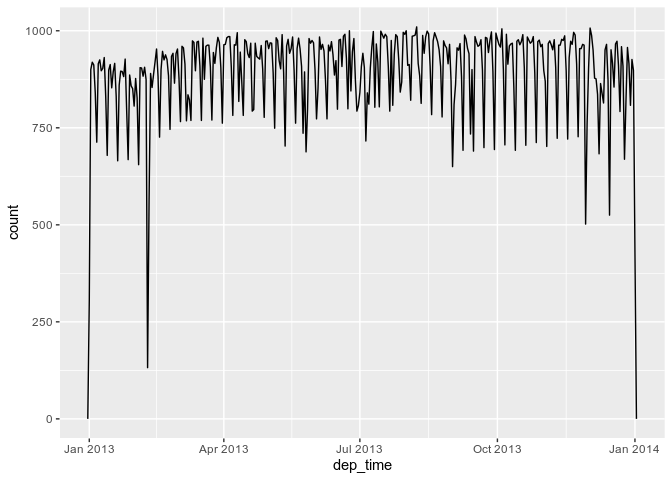

Chapter 13
================
Federico Andrade-Rivas
March 19, 2020

Chapter 13 Dates and Times
--------------------------

``` r
library(tidyverse)
```

    ## ── Attaching packages ─────────────────────────────────────────────────────────────── tidyverse 1.3.0 ──

    ## ✔ ggplot2 3.2.1     ✔ purrr   0.3.3
    ## ✔ tibble  2.1.3     ✔ dplyr   0.8.3
    ## ✔ tidyr   1.0.0     ✔ stringr 1.4.0
    ## ✔ readr   1.3.1     ✔ forcats 0.4.0

    ## ── Conflicts ────────────────────────────────────────────────────────────────── tidyverse_conflicts() ──
    ## ✖ dplyr::filter() masks stats::filter()
    ## ✖ dplyr::lag()    masks stats::lag()

``` r
library(lubridate)
```

    ## 
    ## Attaching package: 'lubridate'

    ## The following object is masked from 'package:base':
    ## 
    ##     date

``` r
library(nycflights13)
```

Get times! Lubridate, and Rbase

``` r
today()
```

    ## [1] "2020-04-03"

``` r
#lubridate

Sys.Date()
```

    ## [1] "2020-04-03"

``` r
#Base R

str(Sys.Date())
```

    ##  Date[1:1], format: "2020-04-03"

``` r
class(Sys.Date())
```

    ## [1] "Date"

``` r
Sys.time()
```

    ## [1] "2020-04-03 10:21:08 PDT"

``` r
#Rbase

now()
```

    ## [1] "2020-04-03 10:21:08 PDT"

``` r
#Lubridate

##They both give you something of class POSIXct in R jargon.
str(Sys.time())
```

    ##  POSIXct[1:1], format: "2020-04-03 10:21:08"

``` r
class(Sys.time())
```

    ## [1] "POSIXct" "POSIXt"

``` r
str(now())
```

    ##  POSIXct[1:1], format: "2020-04-03 10:21:08"

``` r
class(now())
```

    ## [1] "POSIXct" "POSIXt"

### 13.5 Get date or date-time from character

An approach is to use the helpers provided by lubridate. They automatically work out the format once you specify the order of the component. To use them, identify the order in which year, month, and day appear in your dates, then arrange “y”, “m”, and “d” in the same order. That gives you the name of the lubridate function that will parse your date. For example:

These functions also take unquoted numbers. This is the most concise way to create a single date/time object, as you might need when filtering date/time data. ymd() is short and unambiguous.

``` r
ymd("2017-01-31")
```

    ## [1] "2017-01-31"

``` r
mdy("January 31st, 2017")
```

    ## [1] "2017-01-31"

``` r
dmy("2017-01-31")
```

    ## Warning: All formats failed to parse. No formats found.

    ## [1] NA

``` r
ymd(20170131)
```

    ## [1] "2017-01-31"

To create a date-time, add an underscore and one or more of “h”, “m”, and “s” to the name of the parsing function:

``` r
ymd_hms("2017-01-31 21:34:58")
```

    ## [1] "2017-01-31 21:34:58 UTC"

``` r
mdy_hm("01/31/2017 08:01")
```

    ## [1] "2017-01-31 08:01:00 UTC"

``` r
##You can also force the creation of a date-time from a date by supplying a timezone:
ymd(20170131, tz = "UTC")
```

    ## [1] "2017-01-31 UTC"

### 13.6 Build date or date-time from parts

Instead of a single string, sometimes you’ll have the individual components of the date-time spread across multiple columns. This is what we have in the flights data:

``` r
flights %>% select(year, month, day, hour, minute)
```

    ## # A tibble: 336,776 x 5
    ##     year month   day  hour minute
    ##    <int> <int> <int> <dbl>  <dbl>
    ##  1  2013     1     1     5     15
    ##  2  2013     1     1     5     29
    ##  3  2013     1     1     5     40
    ##  4  2013     1     1     5     45
    ##  5  2013     1     1     6      0
    ##  6  2013     1     1     5     58
    ##  7  2013     1     1     6      0
    ##  8  2013     1     1     6      0
    ##  9  2013     1     1     6      0
    ## 10  2013     1     1     6      0
    ## # … with 336,766 more rows

To create a date/time from this sort of input, use make\_date() for dates, or make\_datetime() for date-times:

``` r
flights %>% select(year, month, day, hour, minute) %>% 
            mutate(departure = make_datetime(year, month, day, hour, minute))
```

    ## # A tibble: 336,776 x 6
    ##     year month   day  hour minute departure          
    ##    <int> <int> <int> <dbl>  <dbl> <dttm>             
    ##  1  2013     1     1     5     15 2013-01-01 05:15:00
    ##  2  2013     1     1     5     29 2013-01-01 05:29:00
    ##  3  2013     1     1     5     40 2013-01-01 05:40:00
    ##  4  2013     1     1     5     45 2013-01-01 05:45:00
    ##  5  2013     1     1     6      0 2013-01-01 06:00:00
    ##  6  2013     1     1     5     58 2013-01-01 05:58:00
    ##  7  2013     1     1     6      0 2013-01-01 06:00:00
    ##  8  2013     1     1     6      0 2013-01-01 06:00:00
    ##  9  2013     1     1     6      0 2013-01-01 06:00:00
    ## 10  2013     1     1     6      0 2013-01-01 06:00:00
    ## # … with 336,766 more rows

Let’s do the same thing for each of the four time columns in flights. The times are represented in a slightly odd format, so we use modulus arithmetic to pull out the hour and minute components. Once I’ve created the date-time variables, I focus in on the variables we’ll explore in the rest of the chapter.

``` r
make_datetime_100 <- function(year, month, day, time) {
make_datetime(year, month, day, time %/% 100, time %% 100)}

flights_dt <- flights %>% 
  filter(!is.na(dep_time), !is.na(arr_time)) %>% 
  mutate(
    dep_time = make_datetime_100(year, month, day, dep_time),
    arr_time = make_datetime_100(year, month, day, arr_time),
    sched_dep_time = make_datetime_100(year, month, day, sched_dep_time),
    sched_arr_time = make_datetime_100(year, month, day, sched_arr_time)
  ) %>% 
  select(origin, dest, ends_with("delay"), ends_with("time"))
##NOTE the ends_with() function. Selects the variable has the string provided at the end =)

flights_dt
```

    ## # A tibble: 328,063 x 9
    ##    origin dest  dep_delay arr_delay dep_time            sched_dep_time     
    ##    <chr>  <chr>     <dbl>     <dbl> <dttm>              <dttm>             
    ##  1 EWR    IAH           2        11 2013-01-01 05:17:00 2013-01-01 05:15:00
    ##  2 LGA    IAH           4        20 2013-01-01 05:33:00 2013-01-01 05:29:00
    ##  3 JFK    MIA           2        33 2013-01-01 05:42:00 2013-01-01 05:40:00
    ##  4 JFK    BQN          -1       -18 2013-01-01 05:44:00 2013-01-01 05:45:00
    ##  5 LGA    ATL          -6       -25 2013-01-01 05:54:00 2013-01-01 06:00:00
    ##  6 EWR    ORD          -4        12 2013-01-01 05:54:00 2013-01-01 05:58:00
    ##  7 EWR    FLL          -5        19 2013-01-01 05:55:00 2013-01-01 06:00:00
    ##  8 LGA    IAD          -3       -14 2013-01-01 05:57:00 2013-01-01 06:00:00
    ##  9 JFK    MCO          -3        -8 2013-01-01 05:57:00 2013-01-01 06:00:00
    ## 10 LGA    ORD          -2         8 2013-01-01 05:58:00 2013-01-01 06:00:00
    ## # … with 328,053 more rows, and 3 more variables: arr_time <dttm>,
    ## #   sched_arr_time <dttm>, air_time <dbl>

Plotting distribution of departure times across the year 

Or within a single day:  Note that when you use date-times in a numeric context (like in a histogram), 1 means 1 second, so a binwidth of 86400 means one day. For dates, 1 means 1 day.

### 16.2.3 From other types (R Studio Book)

You may want to switch between a date-time and a date. That’s the job of as\_datetime() and as\_date():

Sometimes you’ll get date/times as numeric offsets from the “Unix Epoch”, 1970-01-01. If the offset is in seconds, use as\_datetime(); if it’s in days, use as\_date().

``` r
as_datetime(today())
```

    ## [1] "2020-04-03 UTC"

``` r
#> [1] "2020-01-15 UTC"
as_date(now())
```

    ## [1] "2020-04-03"

``` r
#> [1] "2020-01-15"


as_datetime(60 * 60 * 10)
```

    ## [1] "1970-01-01 10:00:00 UTC"

``` r
#> [1] "1970-01-01 10:00:00 UTC"
as_date(365 * 10 + 2)
```

    ## [1] "1980-01-01"

``` r
#> [1] "1980-01-01"
```

### 16.2.4 Exercises

1.  What happens if contains invalid dates?

``` r
ymd(c("2010-10-10", "bananas"))
```

    ## Warning: 1 failed to parse.

    ## [1] "2010-10-10" NA

1.  What does the tzone argument to today() do? Why is it important? It specifies the time zone. The default is the computer's time zone

2.  Use the appropriate lubridate function to parse each of the following dates: d1 &lt;- "January 1, 2010" d2 &lt;- "2015-Mar-07" d3 &lt;- "06-Jun-2017" d4 &lt;- c("August 19 (2015)", "July 1 (2015)") d5 &lt;- "12/30/14" \# Dec 30, 2014

``` r
d1 <- "January 1, 2010"
mdy(d1)
```

    ## [1] "2010-01-01"

``` r
d2 <- "2015-Mar-07"
ymd(d2)
```

    ## [1] "2015-03-07"

``` r
d3 <- "06-Jun-2017"
dmy(d3)
```

    ## [1] "2017-06-06"

``` r
d4 <- c("August 19 (2015)", "July 1 (2015)")
mdy(d4)
```

    ## [1] "2015-08-19" "2015-07-01"

``` r
d5 <- "12/30/14" # Dec 30, 2014
mdy(d5)
```

    ## [1] "2014-12-30"

#### 16.3.1 Getting components

You can pull out individual parts of the date with the accessor functions year(), month(), mday() (day of the month), yday() (day of the year), wday() (day of the week), hour(), minute(), and second().

``` r
datetime <- ymd_hms("2016-07-08 12:34:56")

year(datetime)
```

    ## [1] 2016

``` r
month(datetime)
```

    ## [1] 7

``` r
mday(datetime)
```

    ## [1] 8

``` r
#mday <- day of the month

yday(datetime)
```

    ## [1] 190

``` r
# yday <- day of the year

wday(datetime)
```

    ## [1] 6

``` r
#wday <- day of the week 

hour(datetime)
```

    ## [1] 12

``` r
minute(datetime)
```

    ## [1] 34

``` r
second(datetime)
```

    ## [1] 56

For month() and wday() you can set label = TRUE to return the abbreviated name of the month or day of the week. Set abbr = FALSE to return the full name.

``` r
month(datetime, label =TRUE, abbr = TRUE)
```

    ## [1] Jul
    ## 12 Levels: Jan < Feb < Mar < Apr < May < Jun < Jul < Aug < Sep < ... < Dec

``` r
month(datetime, label =TRUE, abbr = FALSE)
```

    ## [1] July
    ## 12 Levels: January < February < March < April < May < June < ... < December

``` r
wday(datetime, label = TRUE, abbr = TRUE)
```

    ## [1] Fri
    ## Levels: Sun < Mon < Tue < Wed < Thu < Fri < Sat

``` r
wday(datetime, label = TRUE, abbr = FALSE)
```

    ## [1] Friday
    ## 7 Levels: Sunday < Monday < Tuesday < Wednesday < Thursday < ... < Saturday

We can use wday() to see that more flights depart during the week than on the weekend:

``` r
flights_dt %>% 
  mutate(wday = wday(dep_time, label = TRUE)) %>% 
  ggplot(aes(x = wday)) +
    geom_bar()
```


There’s an interesting pattern if we look at the average departure delay by minute within the hour. It looks like flights leaving in minutes 20-30 and 50-60 have much lower delays than the rest of the hour!

``` r
flights_dt %>% 
  mutate(minute = minute(dep_time)) %>% 
  group_by(minute) %>% 
  summarise(
    avg_delay = mean(arr_delay, na.rm = TRUE),
    n = n()) %>% 
  ggplot(aes(minute, avg_delay)) +
    geom_line()
```


Interestingly, if we look at the scheduled departure time we don’t see such a strong pattern:

``` r
sched_dep <- flights_dt %>% 
  mutate(minute = minute(sched_dep_time)) %>% 
  group_by(minute) %>% 
  summarise(
    avg_delay = mean(arr_delay, na.rm = TRUE),
    n = n())

ggplot(sched_dep, aes(minute, avg_delay)) +
  geom_line()
```


So why do we see that pattern with the actual departure times? Well, like much data collected by humans, there’s a strong bias towards flights leaving at “nice” departure times. Always be alert for this sort of pattern whenever you work with data that involves human judgement!

``` r
ggplot(sched_dep, aes(minute, n)) +
  geom_line()
```


#### 16.3.2 Rounding

An alternative approach to plotting individual components is to round the date to a nearby unit of time, with floor\_date(), round\_date(), and ceiling\_date(). Each function takes a vector of dates to adjust and then the name of the unit round down (floor), round up (ceiling), or round to. This, for example, allows us to plot the number of flights per week:

``` r
flights_dt %>% 
  count(week = floor_date(dep_time, "week")) %>% 
  ggplot(aes(week, n)) +
    geom_line()
```


#### 16.3.3 Setting components

You can also use each accessor function to set the components of a date/time:

``` r
(datetime <- ymd_hms("2016-07-08 12:34:56"))
```

    ## [1] "2016-07-08 12:34:56 UTC"

``` r
#> [1] "2016-07-08 12:34:56 UTC"

year(datetime) <- 2020
datetime
```

    ## [1] "2020-07-08 12:34:56 UTC"

``` r
#> [1] "2020-07-08 12:34:56 UTC"
month(datetime) <- 01
datetime
```

    ## [1] "2020-01-08 12:34:56 UTC"

``` r
#> [1] "2020-01-08 12:34:56 UTC"
hour(datetime) <- hour(datetime) + 1
datetime
```

    ## [1] "2020-01-08 13:34:56 UTC"

``` r
#> [1] "2020-01-08 13:34:56 UTC"
```

Alternatively, rather than modifying in place, you can create a new date-time with update(). This also allows you to set multiple values at once.

``` r
update(datetime, year = 2020, month = 2, mday = 2, hour = 2)
```

    ## [1] "2020-02-02 02:34:56 UTC"

``` r
#> [1] "2020-02-02 02:34:56 UTC"
```

If values are too big, they will roll-over:

``` r
ymd("2015-02-01") %>% 
  update(mday = 30)
```

    ## [1] "2015-03-02"

``` r
#> [1] "2015-03-02"
ymd("2015-02-01") %>% 
  update(hour = 400)
```

    ## [1] "2015-02-17 16:00:00 UTC"

``` r
#> [1] "2015-02-17 16:00:00 UTC"
```

You can use update() to show the distribution of flights across the course of the day for every day of the year:

``` r
flights_dt %>% 
  mutate(dep_hour = update(dep_time, yday = 300)) %>% 
  ggplot(aes(dep_hour)) +
    geom_freqpoly(binwidth = 300)
```


### 16.3.4 Exercises TO DO ONCE I TAKE GGPLOT (GOOD EXERCISE)

1 How does the distribution of flight times within a day change over the course of the year?

2 Compare dep\_time, sched\_dep\_time and dep\_delay. Are they consistent? Explain your findings.

3 Compare air\_time with the duration between the departure and arrival. Explain your findings. (Hint: consider the location of the airport.)

4 How does the average delay time change over the course of a day? Should you use dep\_time or sched\_dep\_time? Why?

5 On what day of the week should you leave if you want to minimise the chance of a delay?

6 What makes the distribution of diamonds*c**a**r**a**t**a**n**d**f**l**i**g**h**t**s*sched\_dep\_time similar?

7 Confirm my hypothesis that the early departures of flights in minutes 20-30 and 50-60 are caused by scheduled flights that leave early. Hint: create a binary variable that tells you whether or not a flight was delayed.

### 16.4 Time spans

Next you’ll learn about how arithmetic with dates works, including subtraction, addition, and division. Along the way, you’ll learn about three important classes that represent time spans:

*durations, which represent an exact number of seconds. *periods, which represent human units like weeks and months. \*intervals, which represent a starting and ending point.

In R, when you subtract two dates, you get a difftime object:

``` r
# How old is Hadley?
h_age <- today() - ymd(19791014)
h_age
```

    ## Time difference of 14782 days

``` r
#> Time difference of 14703 days
```

A difftime class object records a time span of seconds, minutes, hours, days, or weeks. This ambiguity can make difftimes a little painful to work with, so lubridate provides an alternative which always uses seconds: the duration.

Durations come with a bunch of convenient constructors:

``` r
as.duration(h_age)
```

    ## [1] "1277164800s (~40.47 years)"

``` r
#> [1] "1270339200s (~40.25 years)"

dseconds(15)
```

    ## [1] "15s"

``` r
#> [1] "15s"
dminutes(10)
```

    ## [1] "600s (~10 minutes)"

``` r
#> [1] "600s (~10 minutes)"
dhours(c(12, 24))
```

    ## [1] "43200s (~12 hours)" "86400s (~1 days)"

``` r
#> [1] "43200s (~12 hours)" "86400s (~1 days)"
ddays(0:5)
```

    ## [1] "0s"                "86400s (~1 days)"  "172800s (~2 days)"
    ## [4] "259200s (~3 days)" "345600s (~4 days)" "432000s (~5 days)"

``` r
#> [1] "0s"                "86400s (~1 days)"  "172800s (~2 days)"
#> [4] "259200s (~3 days)" "345600s (~4 days)" "432000s (~5 days)"
dweeks(3)
```

    ## [1] "1814400s (~3 weeks)"

``` r
#> [1] "1814400s (~3 weeks)"
dyears(1)
```

    ## [1] "31536000s (~52.14 weeks)"

``` r
#> [1] "31536000s (~52.14 weeks)"
```

You can add and multiply durations:

You can add and subtract durations to and from days:

``` r
2 * dyears(1)
```

    ## [1] "63072000s (~2 years)"

``` r
#> [1] "63072000s (~2 years)"
dyears(1) + dweeks(12) + dhours(15)
```

    ## [1] "38847600s (~1.23 years)"

``` r
#> [1] "38847600s (~1.23 years)"

tomorrow <- today() + ddays(1)
last_year <- today() - dyears(1)
```

However, because durations represent an exact number of seconds, sometimes you might get an unexpected result:

``` r
one_pm <- ymd_hms("2016-03-12 13:00:00", tz = "America/New_York")

one_pm
```

    ## [1] "2016-03-12 13:00:00 EST"

``` r
#> [1] "2016-03-12 13:00:00 EST"
one_pm + ddays(1)
```

    ## [1] "2016-03-13 14:00:00 EDT"

``` r
#> [1] "2016-03-13 14:00:00 EDT"
```

WHY? ---&gt; Why is one day after 1pm on March 12, 2pm on March 13?! If you look carefully at the date you might also notice that the time zones have changed. Because of DST, March 12 only has 23 hours, so if we add a full days worth of seconds we end up with a different time.

*That is why lubridate offers the options to work in periods which uses "human" time*

#### 16.4.2 Periods

PEriods have a fixed time but tey do not work in seconds but in human time. More intuitive for many applications (notice that the function only changes slightly days() vs ddays())

``` r
one_pm
```

    ## [1] "2016-03-12 13:00:00 EST"

``` r
one_pm + days(2)
```

    ## [1] "2016-03-14 13:00:00 EDT"

Like durations, periods can be created with a number of friendly constructor functions.

``` r
seconds(15)
```

    ## [1] "15S"

``` r
#> [1] "15S"
minutes(10)
```

    ## [1] "10M 0S"

``` r
#> [1] "10M 0S"
hours(c(12, 24))
```

    ## [1] "12H 0M 0S" "24H 0M 0S"

``` r
#> [1] "12H 0M 0S" "24H 0M 0S"
days(7)
```

    ## [1] "7d 0H 0M 0S"

``` r
#> [1] "7d 0H 0M 0S"
months(1:6)
```

    ## [1] "1m 0d 0H 0M 0S" "2m 0d 0H 0M 0S" "3m 0d 0H 0M 0S" "4m 0d 0H 0M 0S"
    ## [5] "5m 0d 0H 0M 0S" "6m 0d 0H 0M 0S"

``` r
#> [1] "1m 0d 0H 0M 0S" "2m 0d 0H 0M 0S" "3m 0d 0H 0M 0S" "4m 0d 0H 0M 0S"
#> [5] "5m 0d 0H 0M 0S" "6m 0d 0H 0M 0S"
weeks(3)
```

    ## [1] "21d 0H 0M 0S"

``` r
#> [1] "21d 0H 0M 0S"
years(1)
```

    ## [1] "1y 0m 0d 0H 0M 0S"

``` r
#> [1] "1y 0m 0d 0H 0M 0S"
```

You can add and multiply periods:

``` r
10 * (months(8) + days(24))
```

    ## [1] "80m 240d 0H 0M 0S"

``` r
days(73) + hours(15) + minutes(189) 
```

    ## [1] "73d 15H 189M 0S"

And of course, add them to dates. Compared to durations, periods are more likely to do what you expect:

``` r
# A leap year
ymd("2016-01-01") + dyears(1)
```

    ## [1] "2016-12-31"

``` r
#> [1] "2016-12-31"
ymd("2016-01-01") + years(1)
```

    ## [1] "2017-01-01"

``` r
#> [1] "2017-01-01"

# Daylight Savings Time
one_pm + ddays(1)
```

    ## [1] "2016-03-13 14:00:00 EDT"

``` r
#> [1] "2016-03-13 14:00:00 EDT"
one_pm + days(1)
```

    ## [1] "2016-03-13 13:00:00 EDT"

``` r
#> [1] "2016-03-13 13:00:00 EDT"
```

Let’s use periods to fix an oddity related to our flight dates. Some planes appear to have arrived at their destination before they departed from New York City.

``` r
flights_dt %>% filter (arr_time < dep_time)
```

    ## # A tibble: 10,633 x 9
    ##    origin dest  dep_delay arr_delay dep_time            sched_dep_time     
    ##    <chr>  <chr>     <dbl>     <dbl> <dttm>              <dttm>             
    ##  1 EWR    BQN           9        -4 2013-01-01 19:29:00 2013-01-01 19:20:00
    ##  2 JFK    DFW          59        NA 2013-01-01 19:39:00 2013-01-01 18:40:00
    ##  3 EWR    TPA          -2         9 2013-01-01 20:58:00 2013-01-01 21:00:00
    ##  4 EWR    SJU          -6       -12 2013-01-01 21:02:00 2013-01-01 21:08:00
    ##  5 EWR    SFO          11       -14 2013-01-01 21:08:00 2013-01-01 20:57:00
    ##  6 LGA    FLL         -10        -2 2013-01-01 21:20:00 2013-01-01 21:30:00
    ##  7 EWR    MCO          41        43 2013-01-01 21:21:00 2013-01-01 20:40:00
    ##  8 JFK    LAX          -7       -24 2013-01-01 21:28:00 2013-01-01 21:35:00
    ##  9 EWR    FLL          49        28 2013-01-01 21:34:00 2013-01-01 20:45:00
    ## 10 EWR    FLL          -9       -14 2013-01-01 21:36:00 2013-01-01 21:45:00
    ## # … with 10,623 more rows, and 3 more variables: arr_time <dttm>,
    ## #   sched_arr_time <dttm>, air_time <dbl>

Fixing it

``` r
flights_dt <- flights_dt %>% 
  mutate(
    overnight = arr_time < dep_time,
    arr_time = arr_time + days(overnight * 1),
    sched_arr_time = sched_arr_time + days(overnight * 1)
  )

flights_dt %>% 
  filter(overnight, arr_time < dep_time) 
```

    ## # A tibble: 0 x 10
    ## # … with 10 variables: origin <chr>, dest <chr>, dep_delay <dbl>,
    ## #   arr_delay <dbl>, dep_time <dttm>, sched_dep_time <dttm>, arr_time <dttm>,
    ## #   sched_arr_time <dttm>, air_time <dbl>, overnight <lgl>

#### 16.4.3 Intervals

dyears(1)/ddays(365) shoudl return 1! But years(1)/days(365) it depends on the specific year That's why

``` r
years(1) / days(1)
```

    ## estimate only: convert to intervals for accuracy

    ## [1] 365.25

INTERVAL is a duration wih an specific starting point If you want a more accurate measurement, you’ll have to use an interval.

``` r
next_year <- today() + years(1)
(today() %--% next_year) / ddays(1)
```

    ## [1] 365

To find out how many periods fall into an interval, you need to use integer division:

``` r
(today() %--% next_year) %/% days(1)
```

    ## Note: method with signature 'Timespan#Timespan' chosen for function '%/%',
    ##  target signature 'Interval#Period'.
    ##  "Interval#ANY", "ANY#Period" would also be valid

    ## [1] 365

### 16.5 Time zones

Time zones are an enormously complicated topic because of their interaction with geopolitical entities. To avoid confusion, R uses the international standard IANA time zones. These use a consistent naming scheme “/”, typically in the form “<continent>/<city>” (there are a few exceptions because not every country lies on a continent). Examples include “America/New\_York”, “Europe/Paris”, and “Pacific/Auckland”. They use names as city names are more stable than time zones names.

You can find out what R thinks your current time zone is with

``` r
Sys.timezone()
```

    ## [1] "America/Vancouver"

``` r
#> [1] "UTC"
```

And see the complete list of all time zone names with

``` r
length(OlsonNames())
```

    ## [1] 607

``` r
#> [1] 607
head(OlsonNames())
```

    ## [1] "Africa/Abidjan"     "Africa/Accra"       "Africa/Addis_Ababa"
    ## [4] "Africa/Algiers"     "Africa/Asmara"      "Africa/Asmera"

``` r
#> [1] "Africa/Abidjan"     "Africa/Accra"       "Africa/Addis_Ababa"
#> [4] "Africa/Algiers"     "Africa/Asmara"      "Africa/Asmera"
```

In R, the time zone is an attribute of the date-time that only controls printing. For example, these three objects represent the same instant in time:

``` r
(x1 <- ymd_hms("2015-06-01 12:00:00", tz = "America/New_York"))
```

    ## [1] "2015-06-01 12:00:00 EDT"

``` r
#> [1] "2015-06-01 12:00:00 EDT"
(x2 <- ymd_hms("2015-06-01 18:00:00", tz = "Europe/Copenhagen"))
```

    ## [1] "2015-06-01 18:00:00 CEST"

``` r
#> [1] "2015-06-01 18:00:00 CEST"
(x3 <- ymd_hms("2015-06-02 04:00:00", tz = "Pacific/Auckland"))
```

    ## [1] "2015-06-02 04:00:00 NZST"

``` r
#> [1] "2015-06-02 04:00:00 NZST"
```

*Unless otherwise specified, lubridate always uses UTC. UTC (Coordinated Universal Time) is the standard time zone used by the scientific community and roughly equivalent to its predecessor GMT (Greenwich Mean Time)*

Operations that combine date-times, like c(), will often drop the time zone. In that case, the date-times will display in your local time zone:

``` r
x4 <- c(x1, x2, x3)
x4
```

    ## [1] "2015-06-01 12:00:00 EDT" "2015-06-01 12:00:00 EDT"
    ## [3] "2015-06-01 12:00:00 EDT"

*I DO NOT UNDERSTAND WHY IT SHOWS EDT, given what the book says it should be my local time Vancouver*

You can change the time zone in two ways (using wiht\_tz() or force\_tz()):

\*Keep the instant in time the same, and change how it’s displayed. Use this when the instant is correct, but you want a more natural display.

``` r
x4a <- with_tz(x4, tzone = "Australia/Lord_Howe")
x4a
```

    ## [1] "2015-06-02 02:30:00 +1030" "2015-06-02 02:30:00 +1030"
    ## [3] "2015-06-02 02:30:00 +1030"

``` r
#> [1] "2015-06-02 02:30:00 +1030" "2015-06-02 02:30:00 +1030"
#> [3] "2015-06-02 02:30:00 +1030"
x4a - x4
```

    ## Time differences in secs
    ## [1] 0 0 0

``` r
#> Time differences in secs
#> [1] 0 0 0
```

(This also illustrates another challenge of times zones: they’re not all integer hour offsets!)

\*Change the underlying instant in time. Use this when you have an instant that has been labelled with the incorrect time zone, and you need to fix it.

``` r
x4b <- force_tz(x4, tzone = "Australia/Lord_Howe")
x4b
```

    ## [1] "2015-06-01 12:00:00 +1030" "2015-06-01 12:00:00 +1030"
    ## [3] "2015-06-01 12:00:00 +1030"

``` r
#> [1] "2015-06-01 12:00:00 +1030" "2015-06-01 12:00:00 +1030"
#> [3] "2015-06-01 12:00:00 +1030"
x4b - x4
```

    ## Time differences in hours
    ## [1] -14.5 -14.5 -14.5

``` r
#> Time differences in hours
#> [1] -14.5 -14.5 -14.5
```
