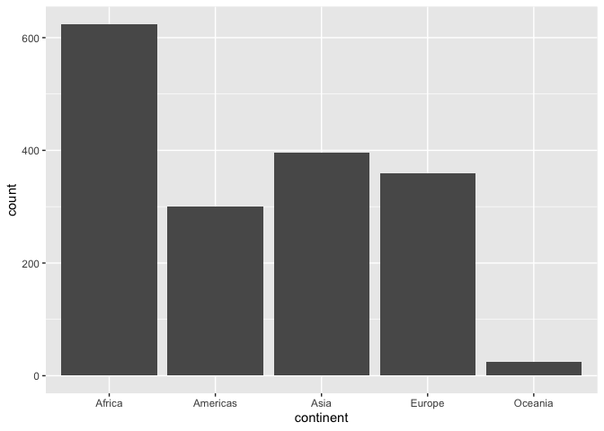

## Load packages

```
## ── Attaching packages ────────────────────── tidyverse 1.3.0 ──
```

```
## ✓ ggplot2 3.2.1     ✓ purrr   0.3.3
## ✓ tibble  2.1.3     ✓ dplyr   0.8.3
## ✓ tidyr   1.0.0     ✓ stringr 1.4.0
## ✓ readr   1.3.1     ✓ forcats 0.4.0
```

```
## ── Conflicts ───────────────────────── tidyverse_conflicts() ──
## x dplyr::filter() masks stats::filter()
## x dplyr::lag()    masks stats::lag()
```

## Exercise 1 - Basic dplyr

```r
# Examine the dataset to make sure it imported properly
glimpse(gapminder)
```

```
## Observations: 1,704
## Variables: 6
## $ country   <fct> Afghanistan, Afghanistan, Afghanistan, Afghanistan, Afghani…
## $ continent <fct> Asia, Asia, Asia, Asia, Asia, Asia, Asia, Asia, Asia, Asia,…
## $ year      <int> 1952, 1957, 1962, 1967, 1972, 1977, 1982, 1987, 1992, 1997,…
## $ lifeExp   <dbl> 28.801, 30.332, 31.997, 34.020, 36.088, 38.438, 39.854, 40.…
## $ pop       <int> 8425333, 9240934, 10267083, 11537966, 13079460, 14880372, 1…
## $ gdpPercap <dbl> 779.4453, 820.8530, 853.1007, 836.1971, 739.9811, 786.1134,…
```

```r
head(gapminder)
```

```
## # A tibble: 6 x 6
##   country     continent  year lifeExp      pop gdpPercap
##   <fct>       <fct>     <int>   <dbl>    <int>     <dbl>
## 1 Afghanistan Asia       1952    28.8  8425333      779.
## 2 Afghanistan Asia       1957    30.3  9240934      821.
## 3 Afghanistan Asia       1962    32.0 10267083      853.
## 4 Afghanistan Asia       1967    34.0 11537966      836.
## 5 Afghanistan Asia       1972    36.1 13079460      740.
## 6 Afghanistan Asia       1977    38.4 14880372      786.
```

```r
tail(gapminder)
```

```
## # A tibble: 6 x 6
##   country  continent  year lifeExp      pop gdpPercap
##   <fct>    <fct>     <int>   <dbl>    <int>     <dbl>
## 1 Zimbabwe Africa     1982    60.4  7636524      789.
## 2 Zimbabwe Africa     1987    62.4  9216418      706.
## 3 Zimbabwe Africa     1992    60.4 10704340      693.
## 4 Zimbabwe Africa     1997    46.8 11404948      792.
## 5 Zimbabwe Africa     2002    40.0 11926563      672.
## 6 Zimbabwe Africa     2007    43.5 12311143      470.
```

```r
colSums(is.na(gapminder))
```

```
##   country continent      year   lifeExp       pop gdpPercap 
##         0         0         0         0         0         0
```

```r
# 1.1 and 1.2 Filter down to year and countries of choice
knitr::kable(
gapminder %>% 
  filter(year >= 1970 & year <= 1979, 
         country == "Canada" | country == "Colombia" | country == "Cote d'Ivoire") %>%
  select(country, gdpPercap)
)
```


country          gdpPercap
--------------  ----------
Canada           18970.571
Canada           22090.883
Colombia          3264.660
Colombia          3815.808
Cote d'Ivoire     2378.201
Cote d'Ivoire     2517.737

```r
# 1.3 Drop in life expectancy
DT::datatable(
gapminder %>% 
  group_by(country) %>% 
  mutate(delta_life_exp = gdpPercap - lag(gdpPercap)) %>%
  filter(delta_life_exp < 0) 
)
```

<!--html_preserve--><div id="htmlwidget-491a0a054da69e5c932d" style="width:100%;height:auto;" class="datatables html-widget"></div>
<script type="application/json" data-for="htmlwidget-491a0a054da69e5c932d">{"x":{"filter":"none","data":[["1","2","3","4","5","6","7","8","9","10","11","12","13","14","15","16","17","18","19","20","21","22","23","24","25","26","27","28","29","30","31","32","33","34","35","36","37","38","39","40","41","42","43","44","45","46","47","48","49","50","51","52","53","54","55","56","57","58","59","60","61","62","63","64","65","66","67","68","69","70","71","72","73","74","75","76","77","78","79","80","81","82","83","84","85","86","87","88","89","90","91","92","93","94","95","96","97","98","99","100","101","102","103","104","105","106","107","108","109","110","111","112","113","114","115","116","117","118","119","120","121","122","123","124","125","126","127","128","129","130","131","132","133","134","135","136","137","138","139","140","141","142","143","144","145","146","147","148","149","150","151","152","153","154","155","156","157","158","159","160","161","162","163","164","165","166","167","168","169","170","171","172","173","174","175","176","177","178","179","180","181","182","183","184","185","186","187","188","189","190","191","192","193","194","195","196","197","198","199","200","201","202","203","204","205","206","207","208","209","210","211","212","213","214","215","216","217","218","219","220","221","222","223","224","225","226","227","228","229","230","231","232","233","234","235","236","237","238","239","240","241","242","243","244","245","246","247","248","249","250","251","252","253","254","255","256","257","258","259","260","261","262","263","264","265","266","267","268","269","270","271","272","273","274","275","276","277","278","279","280","281","282","283","284","285","286","287","288","289","290","291","292","293","294","295","296","297","298","299","300","301","302","303","304","305","306","307","308","309","310","311","312","313","314","315","316","317","318","319","320","321","322","323","324","325","326","327","328","329","330","331","332"],["Afghanistan","Afghanistan","Afghanistan","Afghanistan","Afghanistan","Albania","Algeria","Algeria","Algeria","Algeria","Angola","Angola","Angola","Angola","Angola","Argentina","Argentina","Bahrain","Bahrain","Bangladesh","Bangladesh","Benin","Benin","Benin","Benin","Benin","Bolivia","Bolivia","Bolivia","Bosnia and Herzegovina","Brazil","Bulgaria","Bulgaria","Burkina Faso","Burundi","Burundi","Burundi","Burundi","Cambodia","Cambodia","Cameroon","Cameroon","Canada","Central African Republic","Central African Republic","Central African Republic","Central African Republic","Central African Republic","Central African Republic","Central African Republic","Central African Republic","Chad","Chad","Chad","Chad","Chile","China","Colombia","Comoros","Comoros","Comoros","Comoros","Comoros","Congo, Dem. Rep.","Congo, Dem. Rep.","Congo, Dem. Rep.","Congo, Dem. Rep.","Congo, Dem. Rep.","Congo, Dem. Rep.","Congo, Dem. Rep.","Congo, Dem. Rep.","Congo, Rep.","Congo, Rep.","Congo, Rep.","Congo, Rep.","Costa Rica","Cote d'Ivoire","Cote d'Ivoire","Cote d'Ivoire","Cote d'Ivoire","Croatia","Cuba","Cuba","Cuba","Cuba","Czech Republic","Djibouti","Djibouti","Djibouti","Djibouti","Djibouti","Dominican Republic","Ecuador","Ecuador","Egypt","El Salvador","Equatorial Guinea","Equatorial Guinea","Eritrea","Eritrea","Eritrea","Eritrea","Ethiopia","Ethiopia","Ethiopia","Finland","Gabon","Gabon","Gabon","Gambia","Gambia","Gambia","Ghana","Ghana","Ghana","Ghana","Guatemala","Guatemala","Guinea","Guinea","Guinea","Guinea","Guinea-Bissau","Guinea-Bissau","Guinea-Bissau","Haiti","Haiti","Haiti","Haiti","Haiti","Haiti","Haiti","Honduras","Honduras","Honduras","Honduras","Hungary","Iceland","Indonesia","Indonesia","Indonesia","Iran","Iran","Iraq","Iraq","Iraq","Iraq","Jamaica","Jamaica","Jamaica","Jamaica","Japan","Jordan","Jordan","Kenya","Kenya","Kenya","Korea, Dem. Rep.","Korea, Dem. Rep.","Korea, Dem. Rep.","Korea, Dem. Rep.","Korea, Dem. Rep.","Kuwait","Kuwait","Kuwait","Kuwait","Kuwait","Kuwait","Lebanon","Lebanon","Lebanon","Lesotho","Lesotho","Liberia","Liberia","Liberia","Liberia","Liberia","Liberia","Libya","Libya","Libya","Libya","Madagascar","Madagascar","Madagascar","Madagascar","Madagascar","Madagascar","Madagascar","Malawi","Malawi","Malawi","Malaysia","Mali","Mauritania","Mauritania","Mauritania","Mauritania","Mauritius","Mauritius","Mexico","Mongolia","Montenegro","Montenegro","Morocco","Morocco","Mozambique","Mozambique","Mozambique","Myanmar","Myanmar","Myanmar","Namibia","Namibia","Nepal","New Zealand","Nicaragua","Nicaragua","Nicaragua","Niger","Niger","Niger","Niger","Niger","Nigeria","Nigeria","Nigeria","Nigeria","Panama","Panama","Paraguay","Paraguay","Peru","Peru","Philippines","Poland","Poland","Reunion","Reunion","Romania","Rwanda","Rwanda","Rwanda","Rwanda","Sao Tome and Principe","Sao Tome and Principe","Sao Tome and Principe","Sao Tome and Principe","Saudi Arabia","Saudi Arabia","Saudi Arabia","Saudi Arabia","Senegal","Senegal","Senegal","Senegal","Senegal","Senegal","Serbia","Serbia","Serbia","Sierra Leone","Sierra Leone","Sierra Leone","Sierra Leone","Slovak Republic","Slovenia","Somalia","Somalia","Somalia","Somalia","Somalia","Somalia","South Africa","South Africa","Sri Lanka","Sudan","Sudan","Sudan","Sudan","Sudan","Swaziland","Switzerland","Syria","Syria","Tanzania","Tanzania","Tanzania","Tanzania","Tanzania","Togo","Togo","Togo","Togo","Togo","Togo","Togo","Trinidad and Tobago","Trinidad and Tobago","Tunisia","Turkey","Turkey","Uganda","Uganda","Uganda","Uganda","Uruguay","Uruguay","Uruguay","Venezuela","Venezuela","Venezuela","Venezuela","Venezuela","Vietnam","Vietnam","West Bank and Gaza","West Bank and Gaza","Yemen, Rep.","Yemen, Rep.","Zambia","Zambia","Zambia","Zambia","Zambia","Zambia","Zimbabwe","Zimbabwe","Zimbabwe","Zimbabwe","Zimbabwe"],["Asia","Asia","Asia","Asia","Asia","Europe","Africa","Africa","Africa","Africa","Africa","Africa","Africa","Africa","Africa","Americas","Americas","Asia","Asia","Asia","Asia","Africa","Africa","Africa","Africa","Africa","Americas","Americas","Americas","Europe","Americas","Europe","Europe","Africa","Africa","Africa","Africa","Africa","Asia","Asia","Africa","Africa","Americas","Africa","Africa","Africa","Africa","Africa","Africa","Africa","Africa","Africa","Africa","Africa","Africa","Americas","Asia","Americas","Africa","Africa","Africa","Africa","Africa","Africa","Africa","Africa","Africa","Africa","Africa","Africa","Africa","Africa","Africa","Africa","Africa","Americas","Africa","Africa","Africa","Africa","Europe","Americas","Americas","Americas","Americas","Europe","Africa","Africa","Africa","Africa","Africa","Americas","Americas","Americas","Africa","Americas","Africa","Africa","Africa","Africa","Africa","Africa","Africa","Africa","Africa","Europe","Africa","Africa","Africa","Africa","Africa","Africa","Africa","Africa","Africa","Africa","Americas","Americas","Africa","Africa","Africa","Africa","Africa","Africa","Africa","Americas","Americas","Americas","Americas","Americas","Americas","Americas","Americas","Americas","Americas","Americas","Europe","Europe","Asia","Asia","Asia","Asia","Asia","Asia","Asia","Asia","Asia","Americas","Americas","Americas","Americas","Asia","Asia","Asia","Africa","Africa","Africa","Asia","Asia","Asia","Asia","Asia","Asia","Asia","Asia","Asia","Asia","Asia","Asia","Asia","Asia","Africa","Africa","Africa","Africa","Africa","Africa","Africa","Africa","Africa","Africa","Africa","Africa","Africa","Africa","Africa","Africa","Africa","Africa","Africa","Africa","Africa","Africa","Asia","Africa","Africa","Africa","Africa","Africa","Africa","Africa","Americas","Asia","Europe","Europe","Africa","Africa","Africa","Africa","Africa","Asia","Asia","Asia","Africa","Africa","Asia","Oceania","Americas","Americas","Americas","Africa","Africa","Africa","Africa","Africa","Africa","Africa","Africa","Africa","Americas","Americas","Americas","Americas","Americas","Americas","Asia","Europe","Europe","Africa","Africa","Europe","Africa","Africa","Africa","Africa","Africa","Africa","Africa","Africa","Asia","Asia","Asia","Asia","Africa","Africa","Africa","Africa","Africa","Africa","Europe","Europe","Europe","Africa","Africa","Africa","Africa","Europe","Europe","Africa","Africa","Africa","Africa","Africa","Africa","Africa","Africa","Asia","Africa","Africa","Africa","Africa","Africa","Africa","Europe","Asia","Asia","Africa","Africa","Africa","Africa","Africa","Africa","Africa","Africa","Africa","Africa","Africa","Africa","Americas","Americas","Africa","Europe","Europe","Africa","Africa","Africa","Africa","Americas","Americas","Americas","Americas","Americas","Americas","Americas","Americas","Asia","Asia","Asia","Asia","Asia","Asia","Africa","Africa","Africa","Africa","Africa","Africa","Africa","Africa","Africa","Africa","Africa"],[1967,1972,1987,1992,1997,1992,1962,1987,1992,1997,1972,1977,1982,1987,1997,1982,2002,1982,1987,1957,1972,1957,1962,1977,1987,1992,1957,1982,1987,1992,1992,1992,1997,1977,1962,1997,2002,2007,1972,1992,1992,1997,1992,1967,1972,1982,1987,1992,1997,2002,2007,1967,1972,1982,1997,1977,1962,2002,1977,1992,1997,2002,2007,1962,1967,1977,1982,1987,1992,1997,2002,1987,1992,1997,2002,1982,1987,1992,2002,2007,1992,1962,1972,1992,1997,1992,1967,1977,1982,1992,1997,1967,1987,2002,1992,1982,1972,1982,1977,1987,2002,2007,1977,1987,1992,1992,1982,1987,2002,1982,1987,1997,1967,1977,1982,1987,1982,1987,1982,1987,1992,2007,1977,1987,2002,1957,1967,1987,1992,1997,2002,2007,1972,1982,1987,2002,1992,1992,1962,1967,2002,1982,1987,1982,1987,1992,1997,1977,1982,1997,2002,2002,1972,1992,1962,1992,2002,1987,1992,1997,2002,2007,1962,1967,1977,1982,1987,2002,1962,1982,1987,1972,1987,1977,1982,1987,1997,2002,2007,1982,1987,1992,1997,1967,1977,1982,1987,1992,1997,2002,1982,1992,2002,1957,1982,1977,1982,1987,1992,1967,1982,1987,1992,1992,1997,1957,1962,1977,1982,1987,1967,1987,1992,1972,1987,1972,1992,1982,1987,1992,1972,1977,1987,1992,1997,1967,1982,1987,2002,1977,1992,1987,2002,1987,1992,1987,1982,1992,1977,1997,1992,1967,1987,1992,1997,1957,1987,1992,1997,1982,1987,1997,2002,1967,1972,1977,1982,1987,1992,1992,1997,2002,1977,1987,1992,1997,1992,1992,1967,1972,1982,1987,1992,2002,1987,1992,1957,1967,1972,1982,1987,1992,1992,1977,1967,1987,1957,1982,1987,1992,1997,1977,1982,1987,1992,1997,2002,2007,1987,1992,1957,1982,2002,1962,1977,1982,1987,1962,1967,2002,1962,1982,1987,1997,2002,1967,1982,2002,2007,1987,1992,1972,1977,1982,1987,1992,1997,1977,1987,1992,2002,2007],[34.02,36.088,40.822,41.674,41.763,71.581,48.303,65.799,67.744,69.152,37.928,39.483,39.942,39.906,40.963,69.942,74.34,69.052,70.75,39.348,45.252,40.358,42.618,49.19,52.337,53.919,41.89,53.859,57.251,72.178,67.057,71.19,70.32,46.137,42.045,45.326,47.36,49.58,40.317,55.803,54.314,52.199,77.95,41.478,43.457,48.295,50.485,49.396,46.066,43.308,44.741,43.601,45.569,49.517,51.573,67.052,44.50136,71.682,50.939,57.939,60.66,62.974,65.152,42.122,44.056,47.804,47.784,47.412,45.548,42.587,44.966,57.47,56.433,52.962,52.97,73.45,54.655,52.044,46.832,48.328,72.527,65.246,70.723,74.414,76.151,72.4,42.074,46.519,48.812,51.604,53.157,56.751,67.231,74.173,63.674,56.604,40.516,43.662,44.535,46.453,55.24,58.04,44.51,46.684,48.091,75.7,56.564,60.19,56.761,45.58,49.265,55.861,48.072,51.756,53.744,55.729,58.137,60.782,42.891,45.552,48.576,56.007,37.465,41.245,45.504,40.696,46.243,53.636,55.089,56.671,58.137,60.916,53.884,60.909,64.492,68.565,69.17,78.77,42.518,45.964,68.588,59.62,63.04,62.038,65.044,59.461,58.811,70.11,71.21,72.262,72.047,82,56.528,68.015,47.949,59.285,50.992,70.647,69.978,67.727,66.662,67.297,60.47,64.624,69.343,71.309,74.174,76.904,62.094,66.983,67.926,49.767,57.18,43.764,44.852,46.027,42.221,43.753,45.678,62.155,66.234,68.755,71.555,42.881,46.881,48.969,49.35,52.214,54.978,57.286,45.642,49.42,45.009,52.102,43.916,50.852,53.599,56.145,58.333,61.557,66.711,69.498,61.271,75.435,75.445,45.423,47.924,42.495,42.795,42.861,49.379,58.339,59.32,53.867,60.835,43.971,76.33,59.298,62.008,65.843,40.546,41.291,44.555,47.391,51.313,41.04,45.826,46.886,46.608,68.681,72.462,67.378,70.755,64.134,66.458,64.151,71.32,70.99,67.064,74.772,69.36,44.1,44.02,23.599,36.087,48.945,61.728,62.742,63.306,63.012,66.295,70.533,71.626,43.563,45.815,48.879,52.379,55.769,58.196,71.659,72.232,73.213,36.788,40.006,38.333,39.897,71.38,73.64,38.977,40.973,42.955,44.501,39.658,45.936,60.834,61.888,61.456,42.858,45.083,50.338,51.744,53.556,58.474,75.39,53.655,66.974,42.974,50.608,51.535,50.44,48.466,52.887,55.471,56.941,58.061,58.39,57.561,58.42,69.582,69.862,47.1,61.036,70.845,45.344,50.35,49.849,51.509,68.253,68.468,75.307,60.77,68.557,70.19,72.146,72.766,47.838,58.816,72.37,73.422,52.922,55.599,50.107,51.386,51.821,50.821,46.1,40.238,57.674,62.351,60.377,39.989,43.487],[11537966,13079460,13867957,16317921,22227415,3326498,11000948,23254956,26298373,29072015,5894858,6162675,7016384,7874230,9875024,29341374,38331121,377967,454612,51365468,70759295,1925173,2151895,3168267,4243788,4981671,3211738,5642224,6156369,4256013,155975974,8658506,8066057,5889574,2961915,6121610,7021078,8390505,7450606,10150094,12467171,14195809,28523502,1733638,1927260,2476971,2840009,3265124,3696513,4048013,4369038,3495967,3899068,4875118,7562011,10599793,665770000,41008227,304739,454429,527982,614382,710960,17486434,19941073,26480870,30646495,35481645,41672143,47798986,55379852,2064095,2409073,2800947,3328795,2424367,10761098,12772596,16252726,18013409,4494013,7254373,8831348,10723260,10983007,10315702,127617,228694,305991,384156,417908,4049146,9545158,12921234,59402198,4474873,277603,285483,2512642,2915959,4414865,4906585,34617799,42999530,52088559,5041039,753874,880397,1299304,715523,848406,1235767,8490213,10538093,11400338,14168101,6395630,7326406,4710497,5650262,6990574,9947814,745228,927524,1332459,3507701,4318137,5756203,6326682,6913545,7607651,8502814,2965146,3669448,4372203,6677328,10348684,259012,99028000,109343000,211060000,43072751,51889696,14173318,16543189,17861905,20775703,2156814,2298309,2531311,2664659,127065841,1613551,3867409,8678557,25020539,31386842,19067554,20711375,21585105,22215365,23301725,358266,575003,1140357,1497494,1891487,2111561,1886848,3086876,3089353,1116779,1599200,1703617,1956875,2269414,2200725,2814651,3193942,3344074,3799845,4364501,4759670,6334556,8007166,9171477,10568642,12210395,14165114,16473477,6502825,10014249,11824495,7739235,6998256,1456688,1622136,1841240,2119465,789309,992040,80122492,2312802,621621,692651,11406350,13056604,11127868,12587223,12891952,25870271,38028578,40546538,821782,1278184,12412593,3437674,2979423,3344353,4017939,5060262,5682086,7332638,8392818,9666252,47287752,73039376,81551520,119901274,1839782,2484997,3886512,5884491,20195924,22430449,60017788,36227381,38370697,492095,684810,22797027,3451079,6349365,7290203,7212583,61325,110812,125911,145608,11254672,14619745,21229759,24501530,3965841,4588696,5260855,6147783,7171347,8307920,9826397,10336594,10111559,3140897,3868905,4260884,4578212,5302888,1999210,3428839,3840161,5828892,6921858,6099799,7753310,35933379,39964159,9128546,12716129,14597019,20367053,24725960,28227588,962344,6316424,5680812,11242847,9452826,19844382,23040630,26605473,30686889,2308582,2644765,3154264,3747553,4320890,4977378,5701579,1191336,1183669,3950849,47328791,67308928,7688797,11457758,12939400,15283050,2598466,2748579,3363085,8143375,15620766,17910182,22374398,24287670,39463910,56142181,3389578,4018332,11219340,13367997,4506497,5216550,6100407,7272406,8381163,9417789,6642107,9216418,10704340,11926563,12311143],[836.1971382,739.9811058,852.3959448,649.3413952,635.341351,2497.437901,2550.81688,5681.358539,5023.216647,4797.295051,5473.288005,3008.647355,2756.953672,2430.208311,2277.140884,8997.897412,8797.640716,19211.14731,18524.02406,661.6374577,630.2336265,959.6010805,949.4990641,1029.161251,1225.85601,1191.207681,2127.686326,3156.510452,2753.69149,2546.781445,6950.283021,6302.623438,5970.38876,743.3870368,355.2032273,463.1151478,446.4035126,430.0706916,421.6240257,682.3031755,1793.163278,1694.337469,26342.88426,1136.056615,1070.013275,956.7529907,844.8763504,747.9055252,740.5063317,738.6906068,706.016537,1196.810565,1104.103987,797.9081006,1004.961353,4756.763836,487.6740183,5755.259962,1172.603047,1246.90737,1173.618235,1075.811558,986.1478792,896.3146335,861.5932424,795.757282,673.7478181,672.774812,457.7191807,312.188423,241.1658765,4201.194937,4016.239529,3484.164376,3484.06197,5262.734751,2156.956069,1648.073791,1648.800823,1544.750112,8447.794873,5180.75591,5305.445256,5592.843963,5431.990415,14297.02122,3020.050513,3081.761022,2879.468067,2377.156192,1895.016984,1653.723003,6481.776993,5773.044512,3794.755195,4098.344175,672.4122571,927.8253427,505.7538077,521.1341333,765.3500015,641.3695236,556.8083834,573.7413142,421.3534653,20647.16499,15113.36194,11864.40844,12521.71392,835.8096108,611.6588611,653.7301704,1125.69716,993.2239571,876.032569,847.0061135,4820.49479,4246.485974,857.2503577,805.5724718,794.3484384,942.6542111,764.7259628,736.4153921,575.7047176,1726.887882,1452.057666,1823.015995,1456.309517,1341.726931,1270.364932,1201.637154,2529.842345,3121.760794,3023.096699,3099.72866,10535.62855,25144.39201,849.2897701,762.4317721,2873.91287,7608.334602,6642.881371,14517.90711,11643.57268,3745.640687,3076.239795,6650.195573,6068.05135,7121.924704,6994.774861,28604.5919,2110.856309,3431.593647,896.9663732,1341.921721,1287.514732,4106.492315,3726.063507,1690.756814,1646.758151,1593.06548,95458.11176,80894.88326,59265.47714,31354.03573,28118.42998,35110.10566,5714.560611,7640.519521,5377.091329,496.5815922,773.9932141,640.3224383,572.1995694,506.1138573,609.1739508,531.4823679,414.5073415,17364.27538,11770.5898,9640.138501,9467.446056,1634.047282,1544.228586,1302.878658,1155.441948,1040.67619,986.2958956,894.6370822,632.8039209,563.2000145,665.4231186,1810.066992,618.0140641,1497.492223,1481.150189,1421.603576,1361.369784,2475.387562,3688.037739,8688.156003,1785.402016,7003.339037,6465.613349,1642.002314,1566.353493,502.3197334,462.2114149,389.8761846,349,385,347,3746.080948,3693.731337,674.7881296,18363.32494,3470.338156,2955.984375,2170.151724,954.2092363,808.8970728,668.3000228,581.182725,580.3052092,1014.514104,1576.97375,1385.029563,1615.286395,5351.912144,6618.74305,3998.875695,3783.674243,6360.943444,4446.380924,2189.634995,8451.531004,7738.881247,4319.804067,6071.941411,6598.409903,510.9637142,847.991217,737.0685949,589.9445051,860.7369026,1516.525457,1428.777814,1339.076036,33693.17525,21198.26136,20586.69019,19014.54118,1612.404632,1597.712056,1561.769116,1518.479984,1441.72072,1367.899369,9325.068238,7914.320304,7236.075251,1348.285159,1294.447788,1068.696278,574.6481576,9498.467723,14214.71681,1284.73318,1254.576127,1176.807031,1093.244963,926.9602964,882.0818218,7825.823398,7225.069258,1072.546602,1687.997641,1659.652775,1895.544073,1507.819159,1492.197043,3553.0224,26982.29052,1881.923632,3116.774285,698.5356073,874.2426069,831.8220794,825.682454,789.1862231,1532.776998,1344.577953,1202.201361,1034.298904,982.2869243,886.2205765,882.9699438,7388.597823,7370.990932,1395.232468,4241.356344,6508.085718,767.2717398,843.7331372,682.2662268,617.7244065,5603.357717,5444.61962,7727.002004,8422.974165,11152.41011,9883.584648,10165.49518,8605.047831,637.1232887,707.2357863,4515.487575,3025.349798,1971.741538,1879.496673,1773.498265,1588.688299,1408.678565,1213.315116,1210.884633,1071.353818,685.5876821,706.1573059,693.4207856,672.0386227,469.7092981],[-16.9035718,-96.2160324,-125.615494,-203.0545496,-14.0000441999999,-1241.494834,-463.159143,-63.8016740000003,-658.141892,-225.921596,-49.48837,-2464.64065,-251.693683,-326.745361,-350.704801,-1081.129328,-2169.641234,-128.95465,-687.123250000001,-22.6067138999999,-90.9524597,-103.1511195,-10.1020163999999,-56.635628,-52.041606,-34.6483289999999,-549.640021,-391.58738,-402.818962,-1767.333312,-856.812797,-1937.231386,-332.234678,-111.3489395,-24.3614008,-168.58473,-16.7116352,-16.332821,-101.8082885,-1.59239769999999,-809.500928,-98.8258089999999,-283.63077,-57.012138,-66.0433399999999,-152.6213473,-111.8766403,-96.9708251999999,-7.39919350000002,-1.81572490000008,-32.6740698,-193.007053,-92.706578,-336.0768494,-53.102947,-737.260601,-88.3129826,-362.101783999999,-764.974628,-69.0734420000001,-73.289135,-97.8066769999998,-89.6636788000001,-9.5455968,-34.7213911,-109.1387865,-122.0094639,-0.973006100000021,-215.0556313,-145.5307577,-71.0225465,-678.312585,-184.955408,-532.075153,-0.102405999999974,-664.142216,-445.7541,-508.882278,-137.464584,-104.050711,-5374.789067,-911.418449,-384.822759,-1940.0808,-160.853548,-2013.42218,-0.9387499999998,-612.45133,-202.292955,-502.946376,-482.139208,-8.414356,-732.014273999999,-1656.411365,-90.7055149999997,-1040.578199,-243.1837454,-30.7414697,-8.57040050000006,-3.741716,-148.1207885,-123.9804779,-9.43556079999996,-4.11943289999999,-152.3878489,-493.847239999999,-6632.21134,-3248.9535,-2201.12796,-48.9456399000001,-224.1507497,-11.8942422,-64.3439580000002,-184.9997509,-117.1913881,-29.0264555,-59.4979579999999,-574.008816,-17.4355066000001,-51.6778859,-11.2240334000001,-2.92937259999997,-55.4986247999999,-101.708575,-220.9597505,-113.479057,-344.531366,-188.143554,-366.706478,-114.582586,-71.361999,-68.7277779999999,-8.42701299999999,-81.4472720000003,-98.6640949999996,-60.7262459999997,-2450.85143,-1778.81427,-9.61050059999991,-86.8579980000001,-245.422733,-4280.260478,-965.453231,-170.327960000001,-2874.33443,-7897.931993,-669.400892,-783.69372,-582.144223,-282.998981,-127.149843,-211.99309,-630.939943,-1017.086265,-47.471942,-20.0151350000001,-72.9702889999999,-0.0329779999992752,-380.428808000001,-2035.306693,-43.9986630000001,-53.692671,-18065.02114,-14563.2285,-50082.38986,-27911.44141,-3235.60575,-5190.5143,-375.226323,-1019.177315,-2263.428192,-2.05743430000001,-23.2698932999999,-162.6830152,-68.1228689000001,-66.0857121,-27.4489683,-77.6915829,-116.9750264,-4586.93638,-5593.68558,-2130.451299,-172.692444999999,-9.3398279999999,-204.334396,-241.349928,-147.43671,-114.765758,-54.3802943999999,-91.6588134,-30.4197557,-72.3173489000001,-26.8526917,-21.0659020000001,-68.3812052,-89.3595580000001,-16.342034,-59.546613,-60.233792,-53.6799249999999,-22.9452240000001,-922.991538,-552.606288,-4729.171133,-537.725688,-46.2012559999998,-75.648821,-222.5980703,-40.1083185,-72.3352303,-39,-39,-38,-47.6138050000004,-497.369173999999,-1.65409579999994,-643.86635,-2016.032933,-514.353781,-785.832651,-100.1756547,-145.3121635,-241.4221126,-87.1172978,-0.877515799999969,-136.413374,-404.978056,-191.944187,-9.65487999999982,-12.3375189999997,-416.036111,-259.627909,-463.726018,-73.5583529999994,-1914.56252,-413.63877,-1056.61045,-1343.469925,-727.854496,-29.3144120000006,-3097.863392,-86.5093585,-33.5794297,-110.9226221,-147.1240898,-18.8466829,-373.69266,-87.7476429999999,-89.7017780000001,-474.587350000002,-12494.91389,-4254.92758,-1572.14901,-42.5840909999999,-14.6925759999999,-35.9429400000001,-43.2891319999999,-76.759264,-73.821351,-6545.810272,-1410.747934,-678.245053,-5.47460299999989,-170.562996,-225.75151,-494.0481204,-2538.799857,-4463.81811,-84.7551559999999,-30.1570529999999,-274.185482,-83.562068,-166.2846666,-48.5146066000001,-742.44283,-600.75414,-10.9854280000002,-271.596126,-28.3448659999999,-307.44435,-387.724914,-15.622116,-431.817412,-212.822520000002,-311.113501,-645.06343,-18.1144648,-88.2496862999999,-42.4205275,-6.1396254,-36.4962309,-116.88319,-188.199045,-142.376592,-167.902457,-52.0119797,-96.0663478,-3.25063269999998,-1730.930784,-17.6068910000004,-73.2431630000001,-27.7659819999999,-93.3441969999994,-7.09932939999999,-107.0027318,-161.4669104,-64.5418203,-547.415252,-158.738096999999,-1503.238704,-1379.492361,-1991.54084,-1268.825462,-568.431130000001,-1560.447349,-134.9258715,-6.30133330000001,-2595.180044,-1490.137777,-5.815472,-92.2448649999999,-3.57905300000016,-184.809966,-180.009734,-195.363449,-2.43048300000009,-139.530815,-113.7744937,-82.6977352,-12.7365202999999,-120.4113376,-202.3293246]],"container":"<table class=\"display\">\n  <thead>\n    <tr>\n      <th> <\/th>\n      <th>country<\/th>\n      <th>continent<\/th>\n      <th>year<\/th>\n      <th>lifeExp<\/th>\n      <th>pop<\/th>\n      <th>gdpPercap<\/th>\n      <th>delta_life_exp<\/th>\n    <\/tr>\n  <\/thead>\n<\/table>","options":{"columnDefs":[{"className":"dt-right","targets":[3,4,5,6,7]},{"orderable":false,"targets":0}],"order":[],"autoWidth":false,"orderClasses":false}},"evals":[],"jsHooks":[]}</script><!--/html_preserve-->

```r
# Note that Dplyr functions automatically removes NAs and don't accept the na.rm argument

# 1.4a Max GDP per country
gapminder %>% 
  group_by(country) %>% 
  summarize(max_gdp = max(gdpPercap))
```

```
## # A tibble: 142 x 2
##    country     max_gdp
##    <fct>         <dbl>
##  1 Afghanistan    978.
##  2 Albania       5937.
##  3 Algeria       6223.
##  4 Angola        5523.
##  5 Argentina    12779.
##  6 Australia    34435.
##  7 Austria      36126.
##  8 Bahrain      29796.
##  9 Bangladesh    1391.
## 10 Belgium      33693.
## # … with 132 more rows
```

```r
# 1.4b Three countries with the largest GPD and lowest GDP
gapminder %>% 
  group_by(country) %>% 
  summarise(max_gdp = max(gdpPercap)) %>% 
  filter(min_rank(max_gdp) <= 3 | min_rank(desc(max_gdp)) <= 3) %>% 
  arrange(max_gdp)
```

```
## # A tibble: 6 x 2
##   country   max_gdp
##   <fct>       <dbl>
## 1 Burundi      632.
## 2 Ethiopia     691.
## 3 Malawi       759.
## 4 Singapore  47143.
## 5 Norway     49357.
## 6 Kuwait    113523.
```

```r
# 1.5 Scatterplot of Canada life expectancy vs GDP
gapminder %>% 
  filter(country == "Canada") %>% 
  ggplot(aes(x = gdpPercap, y = lifeExp)) +
    geom_point() +
    scale_x_log10()
```

<!-- -->
Apparently to use DT::datatable() you need to render the doc as an html, not as a git_hub doc

## Exercise 2 - explore individual variables
2.1 Categorical variable - continent

```r
n_distinct(gapminder$continent)
```

```
## [1] 5
```

```r
levels(gapminder$continent)
```

```
## [1] "Africa"   "Americas" "Asia"     "Europe"   "Oceania"
```

```r
table(gapminder$continent)
```

```
## 
##   Africa Americas     Asia   Europe  Oceania 
##      624      300      396      360       24
```

```r
ggplot(gapminder, aes(x = continent)) +
  geom_bar()
```

<!-- -->


```r
kable(table(gapminder$continent), caption = "Frequency by continent")
```


Table: Frequency by continent

Var1        Freq
---------  -----
Africa       624
Americas     300
Asia         396
Europe       360
Oceania       24

2.2 Quantitative variable - life expectancy

```r
# Range
range(gapminder$lifeExp)
```

```
## [1] 23.599 82.603
```

```r
# 5 var summary and IQR
summary(gapminder$lifeExp)
```

```
##    Min. 1st Qu.  Median    Mean 3rd Qu.    Max. 
##   23.60   48.20   60.71   59.47   70.85   82.60
```

```r
boxplot(gapminder$lifeExp)
```

<!-- -->

## Recycling
The issue with this command is that it should produce a table of 24 rows, and instead it is only 12

```r
table(gapminder$country) #Sadly table() does not knit with the datatable function
```

```
## 
##              Afghanistan                  Albania                  Algeria 
##                       12                       12                       12 
##                   Angola                Argentina                Australia 
##                       12                       12                       12 
##                  Austria                  Bahrain               Bangladesh 
##                       12                       12                       12 
##                  Belgium                    Benin                  Bolivia 
##                       12                       12                       12 
##   Bosnia and Herzegovina                 Botswana                   Brazil 
##                       12                       12                       12 
##                 Bulgaria             Burkina Faso                  Burundi 
##                       12                       12                       12 
##                 Cambodia                 Cameroon                   Canada 
##                       12                       12                       12 
## Central African Republic                     Chad                    Chile 
##                       12                       12                       12 
##                    China                 Colombia                  Comoros 
##                       12                       12                       12 
##         Congo, Dem. Rep.              Congo, Rep.               Costa Rica 
##                       12                       12                       12 
##            Cote d'Ivoire                  Croatia                     Cuba 
##                       12                       12                       12 
##           Czech Republic                  Denmark                 Djibouti 
##                       12                       12                       12 
##       Dominican Republic                  Ecuador                    Egypt 
##                       12                       12                       12 
##              El Salvador        Equatorial Guinea                  Eritrea 
##                       12                       12                       12 
##                 Ethiopia                  Finland                   France 
##                       12                       12                       12 
##                    Gabon                   Gambia                  Germany 
##                       12                       12                       12 
##                    Ghana                   Greece                Guatemala 
##                       12                       12                       12 
##                   Guinea            Guinea-Bissau                    Haiti 
##                       12                       12                       12 
##                 Honduras         Hong Kong, China                  Hungary 
##                       12                       12                       12 
##                  Iceland                    India                Indonesia 
##                       12                       12                       12 
##                     Iran                     Iraq                  Ireland 
##                       12                       12                       12 
##                   Israel                    Italy                  Jamaica 
##                       12                       12                       12 
##                    Japan                   Jordan                    Kenya 
##                       12                       12                       12 
##         Korea, Dem. Rep.              Korea, Rep.                   Kuwait 
##                       12                       12                       12 
##                  Lebanon                  Lesotho                  Liberia 
##                       12                       12                       12 
##                    Libya               Madagascar                   Malawi 
##                       12                       12                       12 
##                 Malaysia                     Mali               Mauritania 
##                       12                       12                       12 
##                Mauritius                   Mexico                 Mongolia 
##                       12                       12                       12 
##               Montenegro                  Morocco               Mozambique 
##                       12                       12                       12 
##                  Myanmar                  Namibia                    Nepal 
##                       12                       12                       12 
##              Netherlands              New Zealand                Nicaragua 
##                       12                       12                       12 
##                    Niger                  Nigeria                   Norway 
##                       12                       12                       12 
##                     Oman                 Pakistan                   Panama 
##                       12                       12                       12 
##                 Paraguay                     Peru              Philippines 
##                       12                       12                       12 
##                   Poland                 Portugal              Puerto Rico 
##                       12                       12                       12 
##                  Reunion                  Romania                   Rwanda 
##                       12                       12                       12 
##    Sao Tome and Principe             Saudi Arabia                  Senegal 
##                       12                       12                       12 
##                   Serbia             Sierra Leone                Singapore 
##                       12                       12                       12 
##          Slovak Republic                 Slovenia                  Somalia 
##                       12                       12                       12 
##             South Africa                    Spain                Sri Lanka 
##                       12                       12                       12 
##                    Sudan                Swaziland                   Sweden 
##                       12                       12                       12 
##              Switzerland                    Syria                   Taiwan 
##                       12                       12                       12 
##                 Tanzania                 Thailand                     Togo 
##                       12                       12                       12 
##      Trinidad and Tobago                  Tunisia                   Turkey 
##                       12                       12                       12 
##                   Uganda           United Kingdom            United States 
##                       12                       12                       12 
##                  Uruguay                Venezuela                  Vietnam 
##                       12                       12                       12 
##       West Bank and Gaza              Yemen, Rep.                   Zambia 
##                       12                       12                       12 
##                 Zimbabwe 
##                       12
```

```r
t <- filter(gapminder, country == c("Rwanda", "Afghanistan"))

nrow(t)
```

```
## [1] 12
```

I'm not really sure why this is, but based on the title of the exercise—and the fact that each year is only in the filtered object once- I'd guess that for each set of unique variables (minus country) it alternates looking for Rwanda and then Afghanistan??? 

Apparently you don't get an error if the dataframe has a number of rows equal to the value of the target (ie 2 countries, so if the df is even)

Apparently this is also related to how == works, nothing to do with dplyr 

See this answer on stacks overflow which is the closest answer I've found: https://stackoverflow.com/questions/25647470/filter-multiple-values-on-a-string-column-in-dplyr

Better options: use %in% or use multiple conditions with or (|)

```r
# Option 1: Use group membership
c_names <- c("Rwanda", "Afghanistan")
filter(gapminder, country %in% c_names)
```

```
## # A tibble: 24 x 6
##    country     continent  year lifeExp      pop gdpPercap
##    <fct>       <fct>     <int>   <dbl>    <int>     <dbl>
##  1 Afghanistan Asia       1952    28.8  8425333      779.
##  2 Afghanistan Asia       1957    30.3  9240934      821.
##  3 Afghanistan Asia       1962    32.0 10267083      853.
##  4 Afghanistan Asia       1967    34.0 11537966      836.
##  5 Afghanistan Asia       1972    36.1 13079460      740.
##  6 Afghanistan Asia       1977    38.4 14880372      786.
##  7 Afghanistan Asia       1982    39.9 12881816      978.
##  8 Afghanistan Asia       1987    40.8 13867957      852.
##  9 Afghanistan Asia       1992    41.7 16317921      649.
## 10 Afghanistan Asia       1997    41.8 22227415      635.
## # … with 14 more rows
```

```r
# Option 2: Use 'or'
filter(gapminder, country == "Rwanda" | country == "Afghanistan")
```

```
## # A tibble: 24 x 6
##    country     continent  year lifeExp      pop gdpPercap
##    <fct>       <fct>     <int>   <dbl>    <int>     <dbl>
##  1 Afghanistan Asia       1952    28.8  8425333      779.
##  2 Afghanistan Asia       1957    30.3  9240934      821.
##  3 Afghanistan Asia       1962    32.0 10267083      853.
##  4 Afghanistan Asia       1967    34.0 11537966      836.
##  5 Afghanistan Asia       1972    36.1 13079460      740.
##  6 Afghanistan Asia       1977    38.4 14880372      786.
##  7 Afghanistan Asia       1982    39.9 12881816      978.
##  8 Afghanistan Asia       1987    40.8 13867957      852.
##  9 Afghanistan Asia       1992    41.7 16317921      649.
## 10 Afghanistan Asia       1997    41.8 22227415      635.
## # … with 14 more rows
```
