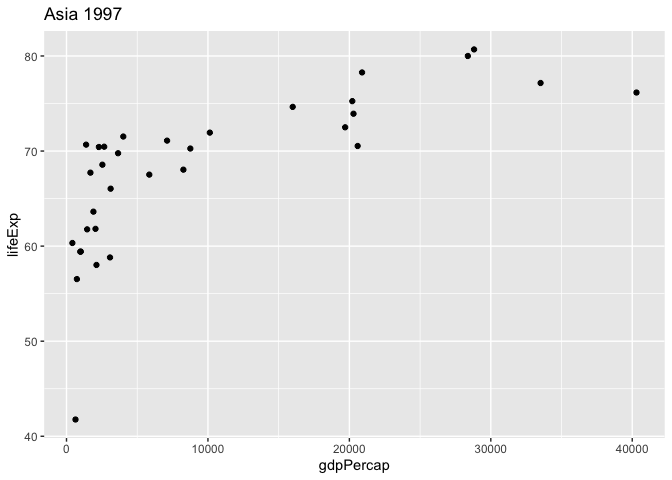

Useful R functions to remember
================
Michelle Coombe
2020-04-29

## Useful R and related references

### Overleaf

This is an online LaTeX writing and publishing tool, and has different
modes depending on your expertise level with LaTeX.
<https://www.overleaf.com/for/authors> Free for personal use :) It does
however, only generate a PDF rather than a word doc, which can be an
issue for submitting to certain journals.

## Useful math, stats, and summarizing functions

#### A function to return the opposite of %in%

``` r
'%nin%' <- Negate('%in%')
```

#### To determine one or more modes

This function finds the factor or number with the most number of
occurances. It will automatically remove any NAs and returns multiple
modes. `v` = vector of numeric or character data. I couldn’t find a
function that did this in another package, so in case it is useful again
in the future, here it is. Thanks to code from this
[website](https://www.tutorialspoint.com/r/r_mean_median_mode.htm) and
from Ken Williams on Stacks overflow.

``` r
get.mode <- function(v) {
  uniqv <- na.omit(unique(v))
  tab <-tabulate(match(v, uniqv))
  uniqv[tab == max(tab)]
  #uniqv [which.max(tabulate(match(v, uniqv)))] #alternative to last two lines, but only returns the first appearance of any ties rather than both
}
```

#### Determining the minimium of multiple numbers in a vector

Min() or max() give you ONE output for a vector, while pmin() or pmax()
can give you MULTIPLE outputs, depending on the length of the input.
From ?pmin help documentation:

``` r
5:1
```

    ## [1] 5 4 3 2 1

``` r
min(5:1, pi)  #Provides ONE output number
```

    ## [1] 1

``` r
pmin(5:1, pi) # Provides 5 output numbers
```

    ## [1] 3.14 3.14 3.00 2.00 1.00

This can be useful when trying to determine a new column based on
several possible input values, kinda like an if\_else statement but
using max or min rather than logical evaluators. See Dr. Caroline
Colijn’s example using data from
Tianjin.

``` r
tdata=read.csv("/Users/Michelle 1/Documents/R projects/ClustersCOVID19/data/Tianjin135casesFeb22.csv",na.strings = "", stringsAsFactors = F)
tdata$symptom_onset=as.Date(tdata$symptom_onset, format = "%d/%m/%Y")
tdata$start_source=as.Date(tdata$start_source, format = "%d/%m/%Y")
tdata$end_source=as.Date(tdata$end_source,format = "%d/%m/%Y" )
tdata$confirm_date=as.Date(tdata$confirm_date,format = "%d/%m/%Y" )

tdata$end_source[which(is.na(tdata$end_source))]=tdata$symptom_onset[which(is.na(tdata$end_source))]  # if no end exposure: set to symptom onset 
tdata$end_source = pmin(tdata$end_source, tdata$symptom_onset) # if end exposure after onset, set to onset 

rm(tdata)
```

#### Getting stats info out of plot objects

You can get info out of (?some) plot objects without plotting it For
example, to get the 5 number summary from a boxplot (numbers between 0
and 100 rather than 0 and 1)

``` r
boxplot(gapminder$lifeExp, plot = F)$stats
```

    ##      [,1]
    ## [1,] 23.6
    ## [2,] 48.2
    ## [3,] 60.7
    ## [4,] 70.8
    ## [5,] 82.6

Cool\!\!\! Good to remember that making the graph is actually a
(desired) side effect of making the boxplot object

#### Comparing doubles and integers

Recall that `identical()` is very strict and does not convert between
different classes, so `dplyr::near()` may be a better
option.

## Useful data wrangling and data exploration functions

#### Determining the number of distinct values in each of each data column after import

This is one of the few things that `glimpse` does not actually show you.
And is often quite useful to know when you import a new dataset. And an
example of how `purrr` can be useful in data exploration.

``` r
# Number of unique values in each column
gapminder %>% map_dbl(n_distinct)
```

    ##   country continent      year   lifeExp       pop gdpPercap 
    ##       142         5        12      1626      1704      1704

``` r
# Look at the class of each column. Glimpse also tells you this, but sometimes it's too much info to quickly take in.
gapminder %>% map_chr(class)
```

    ##   country continent      year   lifeExp       pop gdpPercap 
    ##  "factor"  "factor" "integer" "numeric" "integer" "numeric"

``` r
# If you want both summaries together, using tilda as anonymous function shorthand
  #This will give a whole bunch of coercesion warnings...that is fine!
gapminder %>% map_df(~(data.frame(unique_values = n_distinct(.x),
                                  column_class = class(.x))),
                     .id = "variable_name") #To keep the variable names (otherwise just get a row with numbers)
```

    ## Warning in bind_rows_(x, .id): Unequal factor levels: coercing to character

    ## Warning in bind_rows_(x, .id): binding character and factor vector, coercing
    ## into character vector
    
    ## Warning in bind_rows_(x, .id): binding character and factor vector, coercing
    ## into character vector
    
    ## Warning in bind_rows_(x, .id): binding character and factor vector, coercing
    ## into character vector
    
    ## Warning in bind_rows_(x, .id): binding character and factor vector, coercing
    ## into character vector
    
    ## Warning in bind_rows_(x, .id): binding character and factor vector, coercing
    ## into character vector

    ##   variable_name unique_values column_class
    ## 1       country           142       factor
    ## 2     continent             5       factor
    ## 3          year            12      integer
    ## 4       lifeExp          1626      numeric
    ## 5           pop          1704      integer
    ## 6     gdpPercap          1704      numeric

#### Printing more lines to console than what it automatically gives you

You need to make the data frame into a tibble and then use the print
function to specify the number of rows. You can also use the options in
`print` to change the max number of extra columns to print abbreviated
information for if the width of the console isn’t wide enough.

``` r
# Default max is 20 rows
print(as.tibble(iris))
```

    ## Warning: `as.tibble()` is deprecated, use `as_tibble()` (but mind the new semantics).
    ## This warning is displayed once per session.

    ## # A tibble: 150 x 5
    ##    Sepal.Length Sepal.Width Petal.Length Petal.Width Species
    ##           <dbl>       <dbl>        <dbl>       <dbl> <fct>  
    ##  1          5.1         3.5          1.4         0.2 setosa 
    ##  2          4.9         3            1.4         0.2 setosa 
    ##  3          4.7         3.2          1.3         0.2 setosa 
    ##  4          4.6         3.1          1.5         0.2 setosa 
    ##  5          5           3.6          1.4         0.2 setosa 
    ##  6          5.4         3.9          1.7         0.4 setosa 
    ##  7          4.6         3.4          1.4         0.3 setosa 
    ##  8          5           3.4          1.5         0.2 setosa 
    ##  9          4.4         2.9          1.4         0.2 setosa 
    ## 10          4.9         3.1          1.5         0.1 setosa 
    ## # … with 140 more rows

``` r
# Print 3 rows
print(as_tibble(iris), n = 3)
```

    ## # A tibble: 150 x 5
    ##   Sepal.Length Sepal.Width Petal.Length Petal.Width Species
    ##          <dbl>       <dbl>        <dbl>       <dbl> <fct>  
    ## 1          5.1         3.5          1.4         0.2 setosa 
    ## 2          4.9         3            1.4         0.2 setosa 
    ## 3          4.7         3.2          1.3         0.2 setosa 
    ## # … with 147 more rows

``` r
# Print 30 rows
print(as_tibble(iris), n = 30)
```

    ## # A tibble: 150 x 5
    ##    Sepal.Length Sepal.Width Petal.Length Petal.Width Species
    ##           <dbl>       <dbl>        <dbl>       <dbl> <fct>  
    ##  1          5.1         3.5          1.4         0.2 setosa 
    ##  2          4.9         3            1.4         0.2 setosa 
    ##  3          4.7         3.2          1.3         0.2 setosa 
    ##  4          4.6         3.1          1.5         0.2 setosa 
    ##  5          5           3.6          1.4         0.2 setosa 
    ##  6          5.4         3.9          1.7         0.4 setosa 
    ##  7          4.6         3.4          1.4         0.3 setosa 
    ##  8          5           3.4          1.5         0.2 setosa 
    ##  9          4.4         2.9          1.4         0.2 setosa 
    ## 10          4.9         3.1          1.5         0.1 setosa 
    ## 11          5.4         3.7          1.5         0.2 setosa 
    ## 12          4.8         3.4          1.6         0.2 setosa 
    ## 13          4.8         3            1.4         0.1 setosa 
    ## 14          4.3         3            1.1         0.1 setosa 
    ## 15          5.8         4            1.2         0.2 setosa 
    ## 16          5.7         4.4          1.5         0.4 setosa 
    ## 17          5.4         3.9          1.3         0.4 setosa 
    ## 18          5.1         3.5          1.4         0.3 setosa 
    ## 19          5.7         3.8          1.7         0.3 setosa 
    ## 20          5.1         3.8          1.5         0.3 setosa 
    ## 21          5.4         3.4          1.7         0.2 setosa 
    ## 22          5.1         3.7          1.5         0.4 setosa 
    ## 23          4.6         3.6          1           0.2 setosa 
    ## 24          5.1         3.3          1.7         0.5 setosa 
    ## 25          4.8         3.4          1.9         0.2 setosa 
    ## 26          5           3            1.6         0.2 setosa 
    ## 27          5           3.4          1.6         0.4 setosa 
    ## 28          5.2         3.5          1.5         0.2 setosa 
    ## 29          5.2         3.4          1.4         0.2 setosa 
    ## 30          4.7         3.2          1.6         0.2 setosa 
    ## # … with 120 more rows

#### Moving around columns in your data frame

Move one (or a few) column to the front of your dataframe. For instance,
you just joined data and you want the sample ID, date and wetland as the
first three columns to make it easier to read when extracting certain
rows or something. Use `dplyr::select(special_var, everything())`, where
`special_var` would be ‘sampleID’ or ‘c(sampleID, date\_col, wtld)’ or
whatever is the column you want first. You could also do
`dplyr::select(special_var, -everything()` if you want only the
`special_var` selected from your data frame.

#### Filtering to multiple rows based on min or max ranks

To get rows from a dataframe with the minimum or maxium value (based on
rank) of a certain variable - use dplyr’s `min_rank` in combination with
`filter`. The advantage is that you don’t just get the sole minimum or
maximum rank (eg with `min` or `max`) but instead can specify the bottom
or top of any ‘n’ value (i.e. top 5). You could also use grouping
variables (e.g. country) to get the top/bottom 5 rows within a country
for that variable.

``` r
library(gapminder)
#Method 2 (using dplyr and putting everything into one table:)
  gapminder %>% 
   filter(min_rank(gdpPercap) <= 5 | min_rank(desc(gdpPercap)) <= 5) %>% 
   arrange(gdpPercap)
```

    ## # A tibble: 10 x 6
    ##    country          continent  year lifeExp      pop gdpPercap
    ##    <fct>            <fct>     <int>   <dbl>    <int>     <dbl>
    ##  1 Congo, Dem. Rep. Africa     2002    45.0 55379852      241.
    ##  2 Congo, Dem. Rep. Africa     2007    46.5 64606759      278.
    ##  3 Lesotho          Africa     1952    42.1   748747      299.
    ##  4 Guinea-Bissau    Africa     1952    32.5   580653      300.
    ##  5 Congo, Dem. Rep. Africa     1997    42.6 47798986      312.
    ##  6 Kuwait           Asia       1967    64.6   575003    80895.
    ##  7 Kuwait           Asia       1962    60.5   358266    95458.
    ##  8 Kuwait           Asia       1952    55.6   160000   108382.
    ##  9 Kuwait           Asia       1972    67.7   841934   109348.
    ## 10 Kuwait           Asia       1957    58.0   212846   113523.

#### Determining which integers represent levels of a factor

You can use `unclass` to determine which integers represent which levels
for a factor class variable. Helpful for troubleshooting characters
vs. factors and the messes they can get you into…

``` r
# Create a new dataframe from subset of gapminder
mini_gap <- gapminder %>% 
  filter(country %in% c("Belgium", "Canada", "United States", "Mexico"), year > 2000) %>% 
  select(-pop, -gdpPercap) %>% 
  droplevels()

# Use unclass to see how R represents the country levels internally
unclass(mini_gap$country)
```

    ## [1] 1 1 2 2 3 3 4 4
    ## attr(,"levels")
    ## [1] "Belgium"       "Canada"        "Mexico"        "United States"

#### Renaming

To name something (especially in a function) use `setNames`. If used in
a function, do this **LAST** as it will both set the names of the object
and then RETURN the object. See example under ?setNames.

You can also use dplyr’s `rename`, which is similar to mutate. Remember
that the NEW column name goes on the LEFT HAND side of the equal side,
while the OLD column name goes on the RIGHT HAND side. The column names
are unquoted, which has caused me many headaches when trying to using in
loops (i.e. `rename(df, col_names[i] = old_column_name)` usually does
NOT work). My work around solution is use a temporary column name within
the loop and then replace that at then end of the loop using `names()`
and `str_replace` where quasi-quotation is not an issues.

Also, see the example using purrr (`map_df` and `data.frame`) below, as
that might actually be even simpler as it binds a new column to your
input data frame adn avoids renaming all together. If you still need to
use `rename`, don’t forget that *vectorized functions* such as `rename`
or `mutate` will NOT work on lists, so you will need to wrap them in a
`map_df` function to be able to apply `dplyr` functions on lists or
nested datasets.

``` r
#load example data
sdates <- read_csv("/Users/Michelle 1/Documents/R projects/ClustersCOVID19/data/COVID-19_Singapore_eg_update_edges.csv")
```

    ## Parsed with column specification:
    ## cols(
    ##   .default = col_character(),
    ##   CaseID = col_double(),
    ##   age = col_double()
    ## )

    ## See spec(...) for full column specifications.

``` r
# Make a vector of all the columns that have a date
date_cols <- c("presumed_infected_date", "last_poss_exposure", "symp_presumed_infector", "date_onset_symptoms",
               "date_quarantine","date_hospital", "date_confirmation", "date_discharge")

# Loop to fix dates in all date columns
for(i in seq_along(date_cols)) {
  
  #Split the dates
  sdates <- sdates %>% separate(date_cols[i],
                                into = c("day","month","year"),
                                sep = "/|-")
  sdates$year <- ifelse(is.na(sdates$year), NA, 2020) #now the whole column is just 2020, not a mix of 20 and 2020, but keep the NAs
  sdates$month <- as.numeric(sdates$month) #removes the issue of some months being represented as 02 or 2
  sdates$day <- as.numeric(sdates$day) #removes the issue of some days being represented as 03 or 3
  #Fix issue of days having been converted into years
    #If the day is larger than 31, then subtract 2000, else return the day already present
  sdates$day <- ifelse(sdates$day > 31, sdates$day - 2000, sdates$day)
  #Unite back into one column, but turns NAs into character strings
  sdates <- sdates %>% 
    unite(col = new_date, day, month, year, sep = "/") 
  #Replace the NA/NA/NA character strings back to NA
  sdates$new_date <- str_replace(sdates$new_date, pattern = "NA/NA/NA", replacement = NA_character_)
  #Turn column into a date
  sdates$new_date <- dmy(sdates$new_date)
  
###~~~~Rename the column with the original column name~~~~~###
  names(sdates) <- str_replace(names(sdates), pattern = "new_date", replacement = date_cols[i])

  #Indicate where in the loop we are in case it fails silently
  print(paste(date_cols[i], "column had dates fixed", sep = " "))
}
```

    ## [1] "presumed_infected_date column had dates fixed"
    ## [1] "last_poss_exposure column had dates fixed"
    ## [1] "symp_presumed_infector column had dates fixed"
    ## [1] "date_onset_symptoms column had dates fixed"
    ## [1] "date_quarantine column had dates fixed"
    ## [1] "date_hospital column had dates fixed"
    ## [1] "date_confirmation column had dates fixed"
    ## [1] "date_discharge column had dates fixed"

``` r
rm(sdates)
```

## Useful functions when dealing with lists:

#### Determining the number of elements at each level in a list

Use `map_int` from purrr package which returns and integer and preserves
the NAME of element in the list (unlike lapply). The function you apply
can be `length` (for a list of vectors, as below), or `nrow` if you have
a list of data frames with multiple columns (as length would just count
all the elements from top L to bottom R within that data frame).

``` r
uneven_list <- list("a" = c(1, 2, 3), "b" = c(1:10), "c" = c(5:11))
map_int(uneven_list, length) #Or use 'nrow' instead of length for data frames
```

    ##  a  b  c 
    ##  3 10  7

#### How to add a new column to your old data frame using purrr

This seems like a much easier solution than fiddling around with a for
loop and trying to bind and rename stuff.

``` r
# Adding your new number to your old data frame
addTen <- function(.x) {
  return(.x + 10)
}

map_df(c(1, 5, 7),
       function(.x){
         return(data.frame(old_number = .x,
                           new_number = addTen(.x)))
       })
```

    ##   old_number new_number
    ## 1          1         11
    ## 2          5         15
    ## 3          7         17

#### How to get example list data

In this case, we are going for a list of data frames (which is kinda the
opposite of a data frame with list-columns). This is how my data ends up
half the time, so good to know how to pull a random subset for testing
on\!

``` r
#Randomly keep only 5 rows from each continent
gapminder_list <- gapminder %>% 
                  split(gapminder$continent) %>% 
                  map(~sample_n(., 5))

gapminder_list
```

    ## $Africa
    ## # A tibble: 5 x 6
    ##   country       continent  year lifeExp      pop gdpPercap
    ##   <fct>         <fct>     <int>   <dbl>    <int>     <dbl>
    ## 1 Cote d'Ivoire Africa     1982    54.0  9025951     2603.
    ## 2 Angola        Africa     2002    41.0 10866106     2773.
    ## 3 Guinea-Bissau Africa     1992    43.3  1050938      746.
    ## 4 Ethiopia      Africa     1957    36.7 22815614      379.
    ## 5 Senegal       Africa     1972    45.8  4588696     1598.
    ## 
    ## $Americas
    ## # A tibble: 5 x 6
    ##   country            continent  year lifeExp     pop gdpPercap
    ##   <fct>              <fct>     <int>   <dbl>   <int>     <dbl>
    ## 1 Puerto Rico        Americas   1997    74.9 3759430    16999.
    ## 2 Nicaragua          Americas   2007    72.9 5675356     2749.
    ## 3 Haiti              Americas   1977    49.9 4908554     1874.
    ## 4 Dominican Republic Americas   1957    49.8 2923186     1544.
    ## 5 Bolivia            Americas   1982    53.9 5642224     3157.
    ## 
    ## $Asia
    ## # A tibble: 5 x 6
    ##   country     continent  year lifeExp       pop gdpPercap
    ##   <fct>       <fct>     <int>   <dbl>     <int>     <dbl>
    ## 1 Iran        Asia       1982    59.6  43072751     7608.
    ## 2 Nepal       Asia       1972    44.0  12412593      675.
    ## 3 China       Asia       1967    58.4 754550000      613.
    ## 4 Yemen, Rep. Asia       1977    44.2   8403990     1830.
    ## 5 Iraq        Asia       2002    57.0  24001816     4391.
    ## 
    ## $Europe
    ## # A tibble: 5 x 6
    ##   country continent  year lifeExp      pop gdpPercap
    ##   <fct>   <fct>     <int>   <dbl>    <int>     <dbl>
    ## 1 Denmark Europe     1957    71.8  4487831    11100.
    ## 2 Germany Europe     1967    70.8 76368453    14746.
    ## 3 Finland Europe     2002    78.4  5193039    28205.
    ## 4 Greece  Europe     1977    73.7  9308479    14196.
    ## 5 Poland  Europe     1962    67.6 30329617     5339.
    ## 
    ## $Oceania
    ## # A tibble: 5 x 6
    ##   country     continent  year lifeExp      pop gdpPercap
    ##   <fct>       <fct>     <int>   <dbl>    <int>     <dbl>
    ## 1 Australia   Oceania    1967    71.1 11872264    14526.
    ## 2 Australia   Oceania    1997    78.8 18565243    26998.
    ## 3 Australia   Oceania    1962    70.9 10794968    12217.
    ## 4 New Zealand Oceania    2007    80.2  4115771    25185.
    ## 5 New Zealand Oceania    1997    77.6  3676187    21050.

#### Useful functions to manipulate elements within a list

I find that lists are a pain in the butt for extracting stuff out. And
don’t forget that vectorized functions (i.e. all of dplyr’s summarizing
functions) do not work on lists\!\!\! So here are some useful functions
that have been mentioned to help do battle with data inside of a list.

  - `pluck(.x, ...)` This allows you to extract elements from within a
    *list*. The argument `.x` is a vector and `...` is a list of
    accessors for indexing the object (can be an integer position,
    string name, or an accessor function such as `function(x)
    x[[2]]$elf`). If you have a list of accessors, you splice those with
    `!!!`. `pluck` returns NULL if the element does not exist.

  - `pull(.data, var = -1)` This function allows you to extract a single
    variable from a *data frame*. The argument `var` is specified as
    either: a variable name, a positive integer (=gives position
    counting from the *left*), or a negative integer (= gives position
    counting from the *right*). From dplyr and so supports
    quasiquotation.

  - `reduce(.x, .f)` This function combines all elements of a list into
    a single object by iteratively applying a function that takes two
    inputs. Very very handy for doing many `left_join()` in a row or
    **doing repeated `rbinds` to turn the rows of a list back into a
    single data frame**. There is also a `reduce2` version. `accumulate`
    does the same things but also returns the intermediate values.

<!-- end list -->

``` r
#Ex of rbind and reducing a list into a data frame
gapminder_list %>% reduce(rbind)
```

    ## # A tibble: 25 x 6
    ##    country            continent  year lifeExp      pop gdpPercap
    ##    <fct>              <fct>     <int>   <dbl>    <int>     <dbl>
    ##  1 Cote d'Ivoire      Africa     1982    54.0  9025951     2603.
    ##  2 Angola             Africa     2002    41.0 10866106     2773.
    ##  3 Guinea-Bissau      Africa     1992    43.3  1050938      746.
    ##  4 Ethiopia           Africa     1957    36.7 22815614      379.
    ##  5 Senegal            Africa     1972    45.8  4588696     1598.
    ##  6 Puerto Rico        Americas   1997    74.9  3759430    16999.
    ##  7 Nicaragua          Americas   2007    72.9  5675356     2749.
    ##  8 Haiti              Americas   1977    49.9  4908554     1874.
    ##  9 Dominican Republic Americas   1957    49.8  2923186     1544.
    ## 10 Bolivia            Americas   1982    53.9  5642224     3157.
    ## # … with 15 more rows

``` r
#Ex of using reduce with an iterative math function
reduce(c(1, 2, 3), sum)
```

    ## [1] 6

``` r
  #This is the equivalent of doing sum(sum(1,2), 3)

#Ex of using accumulate
accumulate(c(1, 2, 3), sum)
```

    ## [1] 1 3 6

  - `modify(.x, .f)` and `modify_if(.x, .p, .f, .else = NULL)` The
    argument `.f` can be a function or a formula. The argument `.p` is a
    single predicate function or a logical vector the same length as
    `.x`. The argument `.else` specifies what function is applied if
    `.p` evaluates to FALSE.

<!-- end list -->

``` r
# Modifying factors to characters
str(iris)
```

    ## 'data.frame':    150 obs. of  5 variables:
    ##  $ Sepal.Length: num  5.1 4.9 4.7 4.6 5 5.4 4.6 5 4.4 4.9 ...
    ##  $ Sepal.Width : num  3.5 3 3.2 3.1 3.6 3.9 3.4 3.4 2.9 3.1 ...
    ##  $ Petal.Length: num  1.4 1.4 1.3 1.5 1.4 1.7 1.4 1.5 1.4 1.5 ...
    ##  $ Petal.Width : num  0.2 0.2 0.2 0.2 0.2 0.4 0.3 0.2 0.2 0.1 ...
    ##  $ Species     : Factor w/ 3 levels "setosa","versicolor",..: 1 1 1 1 1 1 1 1 1 1 ...

``` r
iris %>% 
  modify_if(is.factor, as.character) %>% str()
```

    ## 'data.frame':    150 obs. of  5 variables:
    ##  $ Sepal.Length: num  5.1 4.9 4.7 4.6 5 5.4 4.6 5 4.4 4.9 ...
    ##  $ Sepal.Width : num  3.5 3 3.2 3.1 3.6 3.9 3.4 3.4 2.9 3.1 ...
    ##  $ Petal.Length: num  1.4 1.4 1.3 1.5 1.4 1.7 1.4 1.5 1.4 1.5 ...
    ##  $ Petal.Width : num  0.2 0.2 0.2 0.2 0.2 0.4 0.3 0.2 0.2 0.1 ...
    ##  $ Species     : chr  "setosa" "setosa" "setosa" "setosa" ...

  - `keep(.x, .p)` This is the list equivalent of `select_if()` or
    `filter`. It only selects columns of a list (`.x`) that satisfy a
    given condition (`.p`). Only elementes where `.p` evaluates to TRUE
    will be kept.

  - `discard(.x, .p)`. This is like `keep`, except that elements where
    `.p` evalues to TRUE will be discarded.

  - `compact(.x, .p = identity)` This is like `discard`, except only
    elements where `.p` evaluates to an empty vector will be discarded

<!-- end list -->

``` r
#Keep all continents where mean life expectancy is less than 50 years
gapminder_list %>% keep(~{mean(.x$lifeExp) < 50})
```

    ## $Africa
    ## # A tibble: 5 x 6
    ##   country       continent  year lifeExp      pop gdpPercap
    ##   <fct>         <fct>     <int>   <dbl>    <int>     <dbl>
    ## 1 Cote d'Ivoire Africa     1982    54.0  9025951     2603.
    ## 2 Angola        Africa     2002    41.0 10866106     2773.
    ## 3 Guinea-Bissau Africa     1992    43.3  1050938      746.
    ## 4 Ethiopia      Africa     1957    36.7 22815614      379.
    ## 5 Senegal       Africa     1972    45.8  4588696     1598.

``` r
# Discard all continents where average life expectancy is less than 50 years
gapminder_list %>% discard(~{mean(.x$lifeExp) < 50})
```

    ## $Americas
    ## # A tibble: 5 x 6
    ##   country            continent  year lifeExp     pop gdpPercap
    ##   <fct>              <fct>     <int>   <dbl>   <int>     <dbl>
    ## 1 Puerto Rico        Americas   1997    74.9 3759430    16999.
    ## 2 Nicaragua          Americas   2007    72.9 5675356     2749.
    ## 3 Haiti              Americas   1977    49.9 4908554     1874.
    ## 4 Dominican Republic Americas   1957    49.8 2923186     1544.
    ## 5 Bolivia            Americas   1982    53.9 5642224     3157.
    ## 
    ## $Asia
    ## # A tibble: 5 x 6
    ##   country     continent  year lifeExp       pop gdpPercap
    ##   <fct>       <fct>     <int>   <dbl>     <int>     <dbl>
    ## 1 Iran        Asia       1982    59.6  43072751     7608.
    ## 2 Nepal       Asia       1972    44.0  12412593      675.
    ## 3 China       Asia       1967    58.4 754550000      613.
    ## 4 Yemen, Rep. Asia       1977    44.2   8403990     1830.
    ## 5 Iraq        Asia       2002    57.0  24001816     4391.
    ## 
    ## $Europe
    ## # A tibble: 5 x 6
    ##   country continent  year lifeExp      pop gdpPercap
    ##   <fct>   <fct>     <int>   <dbl>    <int>     <dbl>
    ## 1 Denmark Europe     1957    71.8  4487831    11100.
    ## 2 Germany Europe     1967    70.8 76368453    14746.
    ## 3 Finland Europe     2002    78.4  5193039    28205.
    ## 4 Greece  Europe     1977    73.7  9308479    14196.
    ## 5 Poland  Europe     1962    67.6 30329617     5339.
    ## 
    ## $Oceania
    ## # A tibble: 5 x 6
    ##   country     continent  year lifeExp      pop gdpPercap
    ##   <fct>       <fct>     <int>   <dbl>    <int>     <dbl>
    ## 1 Australia   Oceania    1967    71.1 11872264    14526.
    ## 2 Australia   Oceania    1997    78.8 18565243    26998.
    ## 3 Australia   Oceania    1962    70.9 10794968    12217.
    ## 4 New Zealand Oceania    2007    80.2  4115771    25185.
    ## 5 New Zealand Oceania    1997    77.6  3676187    21050.

  - `every(.x, .p)` This asks a logical question of a list. For
    instance, does every continent in gapminder have an average life
    expectancy greater than 70?

<!-- end list -->

``` r
gapminder_list %>% every(~{mean(.x$lifeExp) > 70})
```

    ## [1] FALSE

  - `some(.x, .p)` This asks a logical question of a list. For instance,
    do *some* continents in gapminder have an average life expectancy
    greater than 70?

<!-- end list -->

``` r
gapminder_list %>% some(~{mean(.x$lifeExp) > 70})
```

    ## [1] TRUE

  - `has_element(.x, .y)` This is the equivalent of `%in%` for lists.
    The argument `.y` is the object to test for.

<!-- end list -->

``` r
list(1, 
     c(2, 5, 1),
     "a") %>% 
  has_element("a")
```

    ## [1] TRUE

## Useful data visualization functions

#### Making a list of plots

I believe using `map2` and friends will return a list of plots, which
you can then extract each element to see each plot; however, you would
need to use `walk` to actually see the plots immediately, without having
to call each one from within the list object. So which you use probably
depends on your goal: do you want a list of plots to use in a different
context (like maybe extract one or two plots at a time for a markdown or
slides - use `map2`) vs. wanting them to appear immediately in your
console for data exploration (use `walk`).

Here is an example of using `map2` to make a list of plots: comparing
life expectancy vs. GDP per capita for each continent/year combination.
An example of using `walk` is in the `purrr` tutorial under the
writing\_functions markdown.

``` r
#Get all distinct combinations that occur
continent_year <- gapminder %>% distinct(continent, year)
head(continent_year, n = 20)
```

    ## # A tibble: 20 x 2
    ##    continent  year
    ##    <fct>     <int>
    ##  1 Asia       1952
    ##  2 Asia       1957
    ##  3 Asia       1962
    ##  4 Asia       1967
    ##  5 Asia       1972
    ##  6 Asia       1977
    ##  7 Asia       1982
    ##  8 Asia       1987
    ##  9 Asia       1992
    ## 10 Asia       1997
    ## 11 Asia       2002
    ## 12 Asia       2007
    ## 13 Europe     1952
    ## 14 Europe     1957
    ## 15 Europe     1962
    ## 16 Europe     1967
    ## 17 Europe     1972
    ## 18 Europe     1977
    ## 19 Europe     1982
    ## 20 Europe     1987

``` r
#NOW extract the continents and year pairs as separate vectors
conts <- continent_year %>% pull(continent) %>% as.character()
yrs <- continent_year %>% pull(year)

#Now plot
plot_list <- map2(.x = conts,
                  .y = yrs,
                  .f = ~{
                    gapminder %>% 
                      filter(continent == .x,
                             year == .y) %>% 
                      ggplot() +
                      geom_point(aes(x = gdpPercap, y = lifeExp)) +
                      ggtitle(glue::glue(.x, " ", .y))
                  })
plot_list[[10]]
```

<!-- -->

#### How to make nice breaks for a histogram

Here is a function to do so

``` r
#Define a function to make nice breaks on a histogram
find_breaks <- function(x){
  rng <- range(x, na.rm = T)
  seq(rng[1], rng[2], length.out = 30) #Where 30 is the number of bins you are using; adjust as necessary
  
#Use map() to iterate find_breaks over sims (a list object with different dataset for plotting)
    #Note this won't run here, just for ease of access to an example
nice_breaks <- map(sims, find_breaks) 
}
```
